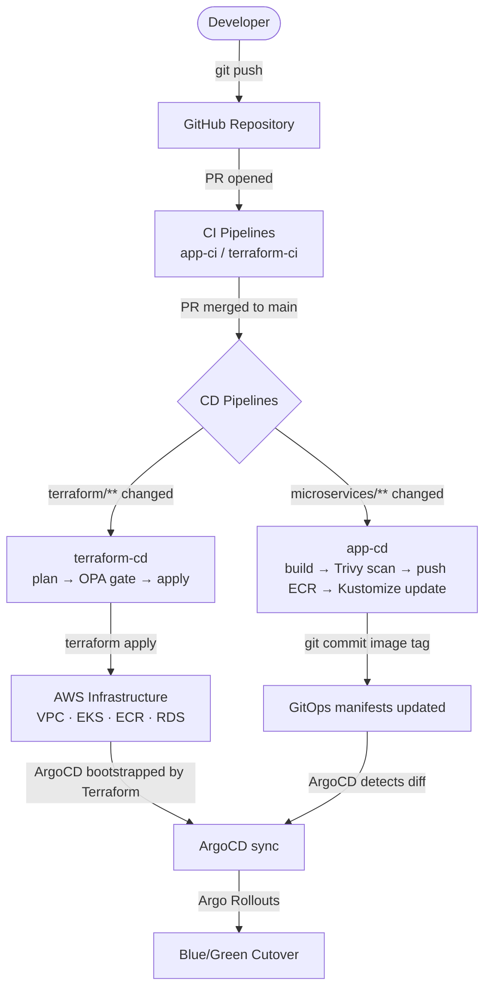
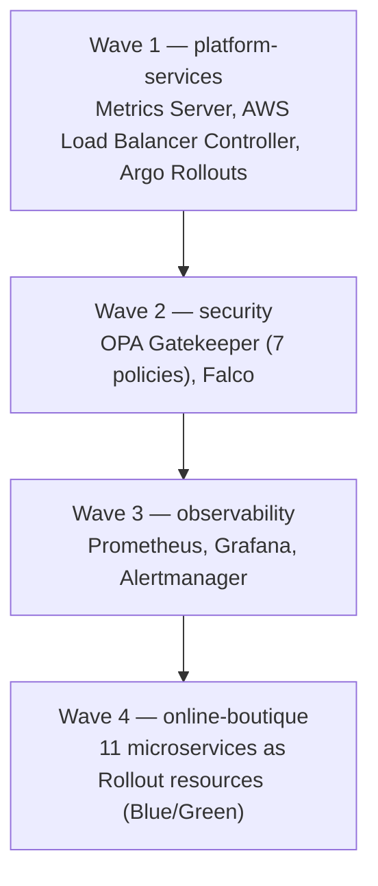
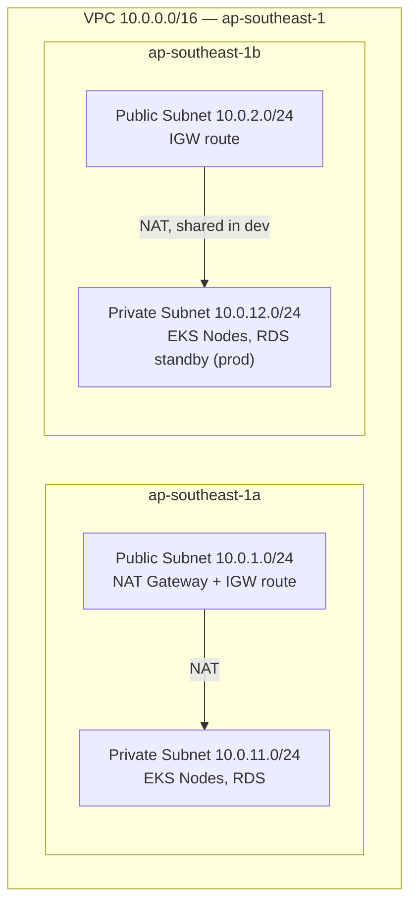
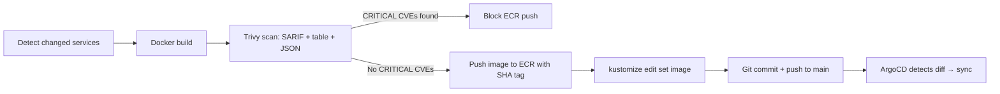
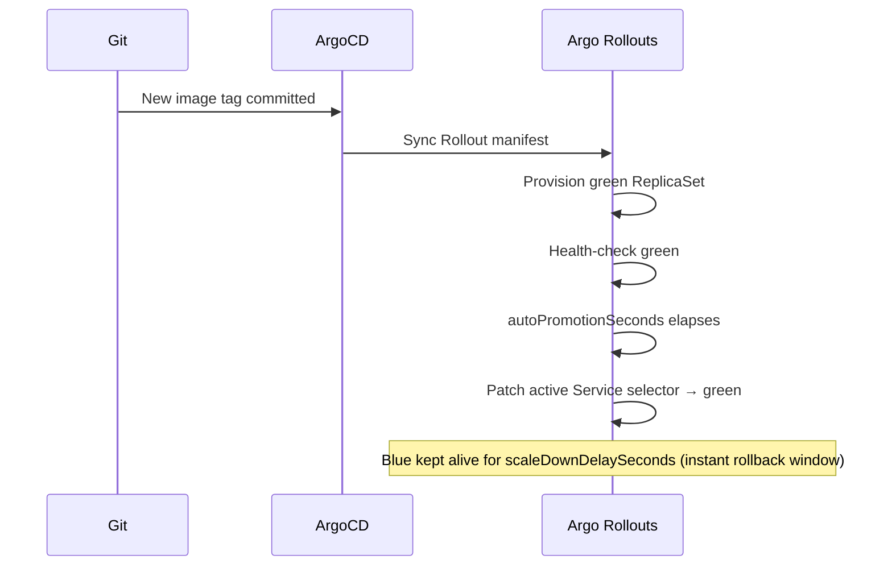
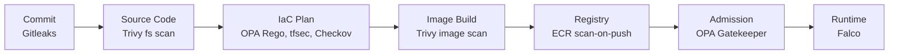
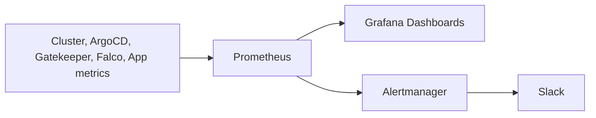
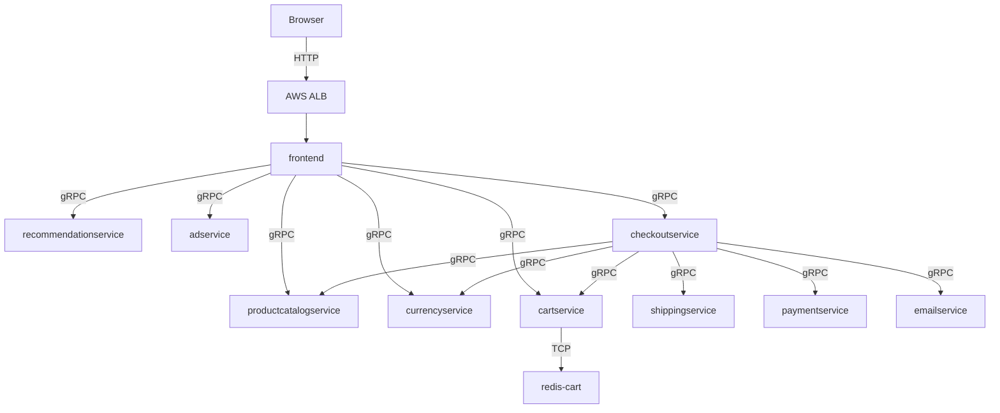

# Cloud-Native Secure GitOps Platform on AWS EKS

A cloud-native DevSecOps platform built on AWS EKS to demonstrate secure, automated, and scalable application delivery through GitOps principles.

The project uses Online Boutique, a microservices-based e-commerce application consisting of 12 services, as the demonstration workload. Rather than focusing solely on application deployment, the project aims to establish a complete platform that integrates infrastructure automation, continuous delivery, policy enforcement, runtime security, and observability within a unified operational workflow.

By combining Infrastructure as Code, GitOps practices, automated security controls, and centralized monitoring, the platform enables infrastructure, applications, and operational policies to be managed consistently through Git, providing reliable deployments, stronger security governance, and improved operational efficiency.

---

## Table of Contents

1. [Introduction](#1-introduction)
2. [Architecture Overview](#2-architecture-overview)
3. [Solution Architecture](#3-solution-architecture)
4. [Repository Structure](#4-repository-structure)
5. [Infrastructure Design](#5-infrastructure-design)
6. [GitOps & CI/CD Workflow](#6-gitops--cicd-workflow)
7. [Required Secrets & Environments](#7-required-secrets--environments)
8. [Security Architecture](#8-security-architecture)
9. [Monitoring & Observability](#9-monitoring--observability)
10. [Application Architecture](#10-application-architecture)
11. [Deployment Guide](#11-deployment-guide)
12. [Testing & Validation](#12-testing--validation)
13. [Future Enhancements](#13-future-enhancements)
14. [References](#14-references)

---

## 1. Introduction

### Project Overview

This project is a self-contained DevSecOps platform that provisions AWS infrastructure with Terraform, bootstraps an Amazon EKS cluster, and delivers a Kubernetes workload entirely through GitOps with ArgoCD. Security controls are enforced at every stage — infrastructure plan time, image build time, admission time, and runtime — rather than bolted on afterward.

### Problem Statement

Microservices teams typically face three compounding challenges: **security drift**, where configurations diverge from policy and vulnerabilities accumulate undetected; **manual toil**, where infrastructure changes and deployments depend on error-prone human coordination; and **observability gaps**, where incidents surface to end users before they surface to engineers.

### Objectives

- Provision AWS infrastructure (networking, compute, registry, database) entirely as code
- Deliver a Kubernetes workload through GitOps rather than manual `kubectl apply`
- Enforce security policy at the IaC, image, admission, and runtime layers
- Provide unified metrics, dashboards, and alerting for the platform and the application

### Scope

| Layer | Technology | Responsibility |
|---|---|---|
| Infrastructure | Terraform on AWS | VPC, EKS, ECR, RDS, ALB, IAM |
| Platform delivery | ArgoCD + Kustomize | GitOps sync, App of Apps |
| Security (static) | OPA Rego | Terraform plan policy gate |
| Security (admission) | OPA Gatekeeper | Kubernetes admission control |
| Security (runtime) | Falco | Syscall-level threat detection |
| Observability | kube-prometheus-stack | Metrics, dashboards, alerting |
| CI/CD | GitHub Actions | Five workflows across infra and application tracks |
| Application | Online Boutique | 11-service gRPC microservices demo |

### Key Capabilities

- Modular Terraform with a remote state backend protected by S3 versioning, DynamoDB locking, and KMS encryption
- ArgoCD App of Apps pattern with sync-wave ordering across platform, security, observability, and application layers
- Blue/Green deployments via Argo Rollouts for zero-impact cutover and instant rollback
- OPA Rego policy gates on Terraform plans, OPA Gatekeeper admission control on the cluster, and Falco runtime detection on every node
- Five GitHub Actions workflows using OIDC-based AWS authentication — no long-lived access keys

---

## 2. Architecture Overview

> **[Architecture Diagram Placeholder]**

The platform begins with Terraform provisioning a VPC, an EKS cluster, ECR repositories, and an RDS instance on AWS. Terraform also bootstraps ArgoCD on the cluster and creates a Root Application that takes over from there. ArgoCD then pulls platform services, security tooling, the observability stack, and the Online Boutique application from Git, applying them in a strict sync-wave order. GitHub Actions pipelines handle both infrastructure changes (plan → OPA policy gate → apply) and application changes (build → scan → push to ECR → update GitOps manifests), with security scanning embedded at every stage rather than performed once at the end.

---

## 3. Solution Architecture

The platform is organized into five cooperating layers.

- **Infrastructure Layer** — Terraform provisions all AWS resources: a VPC with public/private subnets across two availability zones, an EKS cluster with a managed node group, ECR repositories for each microservice, an RDS PostgreSQL instance, and the IAM roles required by the cluster and its controllers. A dedicated `argocd-bootstrap` module installs ArgoCD via Helm and creates the Root Application, handing control to GitOps entirely.

- **GitOps Layer** — ArgoCD continuously reconciles the cluster state against what is declared in Git. A single Root Application watches `platform/gitops/argocd/applications/` and manages four child Applications, each deployed in a specific sync wave to respect dependency ordering.

- **Security Layer** — Controls operate at four points in the lifecycle: OPA Rego evaluates Terraform plans before apply, Trivy scans container images before they reach the registry, OPA Gatekeeper validates every Pod at admission time, and Falco inspects syscalls at runtime on every node.

- **Observability Layer** — Prometheus scrapes metrics from the cluster, ArgoCD, Gatekeeper, Falco, and the application services. Grafana visualizes them through three custom dashboards, and Alertmanager routes alert conditions to Slack.

- **Application Layer** — Online Boutique runs as 11 interconnected gRPC microservices plus a Redis cache and a load generator, deployed as Argo Rollouts resources to support Blue/Green delivery.

### End-to-End Platform Flow



### Sync Wave Ordering

ArgoCD deploys platform components in strict wave order so that admission webhooks and dependencies are ready before the components that depend on them start.



---

## 4. Repository Structure

```text
aws-eks-devsecops-platform/
├── .github/workflows/              # CI/CD: terraform-ci, terraform-cd, app-ci, app-cd, check-scan
├── microservices-application/      # Online Boutique source code (11 services + protos)
├── platform/
│   ├── infrastructure/terraform/   # IaC: bootstrap, environments, modules, OPA policies
│   ├── gitops/                     # ArgoCD App of Apps + Kustomize manifests (dev/prod overlays)
│   └── observability/              # Observability runbooks
└── docs/                           # Architecture notes and diagram sources
```

---

## 5. Infrastructure Design

### AWS Networking



The VPC module applies Kubernetes-specific subnet tags required by the AWS Load Balancer Controller for automatic subnet discovery:

| Tag | Value | Subnet | Purpose |
|---|---|---|---|
| `kubernetes.io/role/elb` | `1` | Public | Internet-facing ALB subnet discovery |
| `kubernetes.io/role/internal-elb` | `1` | Private | Internal ALB subnet discovery |
| `kubernetes.io/cluster/<name>` | `shared` | Both | EKS subnet ownership |

**Security Groups:**

| Security Group | Inbound | Outbound |
|---|---|---|
| EKS Control Plane | Node group (HTTPS 443) | Node group (all) |
| EKS Nodes | Control plane, node-to-node | All (ECR pull, AWS API) |
| ALB | Internet (HTTP 80, HTTPS 443) | EKS nodes |
| RDS | EKS nodes (PostgreSQL 5432) | None |

### Amazon EKS

The cluster (`eks-devsecops-dev-cluster`, Kubernetes 1.33) runs a single managed node group of `t3.medium` instances (`AL2023_x86_64_STANDARD`, on-demand, 20 GiB gp3 disk) with `desired=2, min=1, max=3` and a rolling update strategy (`max_unavailable=1`). API access is configured for both public and private endpoints, and control plane logs (`api`, `audit`, `authenticator`, `controllerManager`, `scheduler`) are shipped to CloudWatch.

Terraform manages four EKS addons:

| Addon | Purpose |
|---|---|
| `vpc-cni` | Pod networking and IP allocation from the VPC CIDR |
| `coredns` | Cluster DNS for service discovery |
| `kube-proxy` | Network rules on each node |
| `aws-ebs-csi-driver` | Dynamic PersistentVolume provisioning (gp3) — required by Prometheus |

### Amazon ECR

Eleven ECR repositories — one per Online Boutique service — are provisioned with lifecycle policies. `scan_on_push` is enabled so every pushed image is rescanned by AWS independently of the CI pipeline's own Trivy scan.

### Amazon RDS

A PostgreSQL 15.7 instance runs with a custom parameter group enabling connection, disconnection, DDL, and slow-query logging (threshold 1000ms). It is Single-AZ in dev and Multi-AZ in production. Automated backups are retained for 7 days with PITR, and Performance Insights is enabled.

### IAM & IRSA

| Role | Trust Principal | Attached Policies |
|---|---|---|
| EKS Cluster Role | `eks.amazonaws.com` | `AmazonEKSClusterPolicy`, `AmazonEKSVPCResourceController` |
| EKS Node Group Role | `ec2.amazonaws.com` | `AmazonEKSWorkerNodePolicy`, `AmazonEKS_CNI_Policy`, `AmazonEC2ContainerRegistryReadOnly`, `AmazonSSMManagedInstanceCore` |
| EBS CSI Driver (IRSA) | OIDC → `kube-system:ebs-csi-controller-sa` | `AmazonEBSCSIDriverPolicy` |
| AWS LBC (IRSA) | OIDC → `kube-system:aws-load-balancer-controller` | Custom policy for ALB/NLB management |

IRSA grants AWS permissions at the pod level rather than the node level — a compromised pod cannot inherit the full node role. This is why the AWS Load Balancer Controller and EBS CSI Driver use IRSA instead of broader node IAM policies.

### Terraform State Management

A one-time `bootstrap` module (run with local state) creates the remote backend: an S3 bucket with versioning, KMS encryption (auto-rotating key), blocked public access, and a 90-day non-current version expiry; and a DynamoDB lock table with `PAY_PER_REQUEST` billing and point-in-time recovery enabled. All subsequent environments use this backend for state locking and encryption.

### High Availability Considerations

| Component | Dev | Prod |
|---|---|---|
| EKS Control Plane | Managed (always HA) | Managed (always HA) |
| EKS Nodes | 2 nodes across 2 AZs | 3+ nodes across 2+ AZs |
| NAT Gateway | 1 shared | 1 per AZ |
| RDS PostgreSQL | Single-AZ | Multi-AZ |
| ArgoCD | 1 replica | 2 replicas |
| ALB | Multi-AZ (managed) | Multi-AZ (managed) |

---

## 6. GitOps & CI/CD Workflow

### Application CI Pipeline (`app-ci.yaml`)

Triggered on PRs to `develop` / `feature/**`. Gitleaks secret scanning runs as a hard gate across the full git history; if it passes, the pipeline runs Kustomize build validation against the Kubernetes 1.33 schema, OPA policy unit tests, Falco rule validation, and a non-blocking Trivy filesystem scan whose results are uploaded to the GitHub Security tab.

### Application CD Pipeline (`app-cd.yaml`)

Triggered on pushes to `main` that touch microservice paths. A `git diff`-based step detects which services changed, then a parallel matrix job builds, scans, and pushes only those services:



### Infrastructure CI Pipeline (`terraform-ci.yaml`)

Triggered on PRs to `develop` / `feature/**` touching Terraform paths. Runs `terraform fmt`/`validate`, `tflint` for AWS provider best practices, `tfsec` for static security misconfigurations, and Checkov for CIS/NIST/SOC 2 compliance mappings — all with results posted to the PR and the Security tab.

### Infrastructure CD Pipeline (`terraform-cd.yaml`)

Triggered on push to `main` or manual dispatch. The pipeline runs `terraform plan`, exports the plan as JSON, evaluates it against three OPA Rego policy files (deny rules block apply; warn rules are logged only), and only proceeds to `terraform apply` if the policy gate passes. A separate `destroy` job is manual-dispatch-only and runs in an isolated environment requiring multiple reviewers.

### ArgoCD Synchronization Flow

The Root Application (created by the Terraform `argocd-bootstrap` module — no manual `kubectl apply` required) watches `platform/gitops/argocd/applications/` and manages four child Applications. ArgoCD polls Git roughly every three minutes, detects divergence, and reconciles via a Kustomize build followed by server-side apply. `selfHeal: true` means any out-of-band manual cluster change is automatically reverted to the Git-declared state.

### Deployment Strategy

Online Boutique services use **Blue/Green** deployment via Argo Rollouts. A new green ReplicaSet is fully provisioned and health-checked before any traffic shifts; the blue ReplicaSet continues serving all production traffic until cutover. Each service exposes two Kubernetes Services — `<name>-active` and `<name>-preview` — and after `autoPromotionSeconds`, Argo Rollouts atomically patches the active Service selector.



### Rollback Strategy

During `scaleDownDelaySeconds` after promotion, the blue ReplicaSet is still running — rollback is a single command and traffic returns to blue within seconds:

```bash
kubectl argo rollouts undo <service-name> -n online-boutique
```

After blue has been scaled down, rollback happens by reverting the image tag commit in Git (`git revert`) and letting ArgoCD re-sync, which runs a fresh Blue/Green cycle with the previous image.

---

## 7. Required Secrets & Environments

### GitHub Repository Secrets

| Secret | Purpose | Workflow Usage |
|---|---|---|
| `AWS_DEV_ROLE_ARN` | ARN of the IAM Role trusted via GitHub OIDC | `terraform-cd`, `app-cd`, `check-scan` |
| `BUCKET_TF_STATE` | S3 bucket name from the bootstrap output | `terraform-cd`, `check-scan` |
| `TF_VAR_DB_PASSWORD` | RDS master password | `terraform-cd` |
| `GITOPS_REPO_URL` | Repository URL used by ArgoCD's bootstrap to configure the repo connection | `terraform-cd` |
| `GITOPS_BOT_TOKEN` | GitHub PAT with content read/write, used to commit image tag updates | `app-cd` |
| `AWS_ACCOUNT_ID` | 12-digit AWS account ID for ECR URI construction | `app-cd` |
| `SLACK_WEBHOOK_URL` | Incoming Webhook URL for pipeline notifications | All workflows |

### OIDC Authentication

All workflows authenticate to AWS via OpenID Connect rather than long-lived access keys. GitHub Actions exchanges a short-lived OIDC token for temporary AWS credentials, scoped by a trust policy that restricts which repository (and optionally which environment) is allowed to assume the role. This removes the need to store or rotate static AWS access keys in GitHub secrets.

For production, tighten the `sub` condition to `environment:dev-apply` to restrict role assumption to the apply job only.

### GitHub Environments

| Environment | Used By | Protection Rules |
|---|---|---|
| `dev-plan` | `terraform-cd` → plan | None — runs automatically |
| `dev-apply` | `terraform-cd` → apply | Optional required reviewers for controlled applies |
| `dev-destroy` | `terraform-cd` → destroy | **Mandatory: 2+ required reviewers, restricted to `main`** |

> `dev-destroy` must always be protected — an unprotected destroy environment with `workflow_dispatch` access can result in complete infrastructure loss in under 15 minutes.

---

## 8. Security Architecture

Security is enforced through a defense-in-depth approach with controls at each stage of the delivery lifecycle.



### Shift-Left Security

Gitleaks scans the full git history on every PR as a hard gate — a single detected secret stops the entire pipeline. Trivy performs a filesystem scan of source code before any image is built, uploading results to the GitHub Security tab as SARIF.

### Infrastructure Security

`terraform plan` output is converted to JSON and evaluated against three OPA Rego policy files before `apply` is permitted:

| Policy File | Key `deny` Rules |
|---|---|
| `security.rego` | EKS unrestricted public endpoint, missing secrets encryption, ECR scan-on-push disabled, RDS publicly accessible, IAM `Action: * / Resource: *` |
| `networking.rego` | Security Group allowing all inbound, SSH open to internet (port 22), EKS nodes in public subnets |
| `compliance.rego` | Missing required tags (`Project`, `Environment`, `ManagedBy`), EBS volume unencrypted, S3 bucket without server-side encryption |

`tfsec` and Checkov additionally run in CI to catch static misconfigurations and map findings to CIS/NIST/SOC 2 compliance frameworks.

### Kubernetes Security

OPA Gatekeeper enforces seven admission policies on every Pod:

| Constraint | Scope | Effect if Violated |
|---|---|---|
| `allow-ecr-and-trusted-registries-only` | `online-boutique` namespace | Rejected — image from unknown registry |
| `disallow-latest-tag` | All namespaces | Rejected — must use an explicit image tag |
| `disallow-privileged` | All namespaces | Rejected — `privileged: true` forbidden |
| `require-labels` | `online-boutique` namespace | Rejected — required labels missing |
| `require-non-root` | All namespaces | Rejected — must run as a non-root UID |
| `require-read-only-root-filesystem` | All namespaces | Rejected — read-only root filesystem required |
| `require-resource-limits` | All namespaces | Rejected — CPU/memory limits required |

System namespaces (`kube-system`, `gatekeeper-system`, `falco`, `monitoring`, `argocd`) are excluded from enforcement to avoid bootstrapping deadlocks.

### Runtime Security

Falco runs as a DaemonSet on every node using the `modern_ebpf` driver, performing syscall-level threat detection and alerting on suspicious runtime behavior such as shell execution inside containers or unexpected privilege escalation.

### IAM Security

No long-lived AWS access keys are used anywhere: GitHub Actions authenticates via OIDC, EC2 nodes use instance profiles, and platform controllers use IRSA scoped to specific Kubernetes service accounts. ArgoCD RBAC defaults to `readonly`; admin access requires `platform-admins` group membership.

### Defense-in-Depth Summary

| Stage | Control |
|---|---|
| Commit | Gitleaks secret scanning (hard gate) |
| Source code | Trivy filesystem scan |
| Infrastructure plan | OPA Rego deny/warn, tfsec, Checkov |
| Image build | Trivy image scan (blocks ECR push on CRITICAL CVEs) |
| Registry | ECR `scan_on_push` |
| Admission | OPA Gatekeeper (7 constraints) |
| Runtime | Falco eBPF syscall detection |

---

## 9. Monitoring & Observability

### Prometheus

Prometheus, deployed via kube-prometheus-stack, scrapes node-exporter, kube-state-metrics, ArgoCD, OPA Gatekeeper, Falco, and the Online Boutique services' `/metrics` endpoints. EKS control plane logs are shipped to CloudWatch (`api`, `audit`, `authenticator`, `controllerManager`, `scheduler`).

### Grafana

Three custom Grafana dashboards are provisioned via ConfigMaps: a cluster overview (node status, pod counts, ArgoCD application health), node metrics (per-node CPU/memory/disk/network), and application metrics (request rate, error rate, and latency for Online Boutique using the RED method).

### Alertmanager

Three Prometheus alert rules route to Slack via Alertmanager: high CPU usage (node > 80% for 5 min), high memory usage (node > 85% for 5 min), and pod restart loops (> 5 restarts in 15 min).



---

## 10. Application Architecture

### Online Boutique Overview

Online Boutique is Google's open-source microservices demo, deployed here as the platform's workload. It consists of 11 services written across Go, Python, Node.js, Java, and C#, plus a Redis cache for cart state and a Locust-based load generator that simulates realistic user traffic.

### Core Services

| Service | Language | Role |
|---|---|---|
| `frontend` | Go | Web UI and entry point; aggregates all backend services |
| `checkoutservice` | Go | Order orchestration — coordinates cart, payment, shipping, email |
| `cartservice` | C# | Shopping cart state, backed by Redis |
| `productcatalogservice` | Go | Product catalogue |
| `currencyservice` | Node.js | Currency conversion |
| `paymentservice` | Node.js | Mock payment processing |
| `shippingservice` | Go | Shipping cost estimation |
| `emailservice` | Python | Order confirmation simulation |
| `recommendationservice` | Python | Product recommendations |
| `adservice` | Java | Contextual advertisements |
| `loadgenerator` | Python (Locust) | Simulated user traffic |

### Service Communication Flow



All inter-service communication uses gRPC over the cluster's internal DNS. The frontend is the only service exposed externally via the ALB Ingress, and integrates with the platform the same way every other workload does — deployed by ArgoCD, governed by OPA Gatekeeper, observed by Falco, and scraped by Prometheus.

---

## 11. Deployment Guide

### Prerequisites

| Tool | Minimum Version |
|---|---|
| Terraform | `>= 1.10.0` |
| AWS CLI | `>= 2.x` |
| kubectl | `>= 1.30` |

Ensure AWS credentials are configured and the GitHub repository secrets from [Section 7](#7-required-secrets--environments) are set before starting.

### Bootstrap Terraform Backend

Run once to create the S3 bucket, DynamoDB lock table, and KMS key:

```bash
cd platform/infrastructure/terraform/bootstrap
terraform init && terraform plan && terraform apply
```

Note the outputs, then configure `environments/dev/backend.tf` with the bucket name and table name.

### Deploy Infrastructure

**Option A — GitHub Actions (recommended):** Push any change to `platform/infrastructure/terraform/environments/dev/` on `main`, or trigger `terraform-cd.yaml` manually with `action: apply`. The pipeline runs plan → OPA gate → apply automatically.

**Option B — Manual:**

```bash
cd platform/infrastructure/terraform/environments/dev

terraform init
terraform plan
terraform apply
```

> **Note:** Set `gitops_root_app_path = "platform/gitops/argocd/applications"` and `argocd_project_name = "platform"` in `terraform.tfvars` before apply. The variable defaults are incorrect.

### Configure kubectl

```bash
aws eks update-kubeconfig --region ap-southeast-1 --name eks-devsecops-dev-cluster
kubectl get nodes  # expect 2 nodes in Ready state
```

### Verify EKS Cluster

```bash
kubectl get nodes
kubectl get pods -n argocd  # expect ArgoCD pods Running
```

### Verify ArgoCD

The Terraform `argocd-bootstrap` module installs ArgoCD and creates the Root Application automatically — no manual `kubectl apply` is required.

```bash
kubectl port-forward svc/argocd-server -n argocd 8080:443
kubectl get secret argocd-initial-admin-secret -n argocd \
  -o jsonpath="{.data.password}" | base64 -d && echo
```

Open `https://localhost:8080`. All four Applications (`platform-services`, `security`, `observability`, `online-boutique`) should reach `Synced / Healthy` within 5–10 minutes.

```bash
kubectl get applications -n argocd
```

### Deploy Application

ArgoCD deploys Online Boutique automatically at wave 4 — no manual step is required.

```bash
kubectl get pods -n online-boutique
kubectl argo rollouts list rollouts -n online-boutique
```

### Access Application

```bash
kubectl get ingress -n online-boutique frontend \
  -o jsonpath='{.status.loadBalancer.ingress[0].hostname}'
```

Open the returned ALB DNS name in a browser to load the storefront.

### Access Monitoring Stack

```bash
kubectl port-forward svc/kube-prometheus-stack-grafana -n monitoring 3000:80
# Default credentials: admin / prom-operator
```

Open `http://localhost:3000` and browse the provisioned dashboards.

### Verify Security Components

```bash
kubectl get pods -n gatekeeper-system
kubectl get constrainttemplates
kubectl get pods -n falco
kubectl logs -n falco -l app.kubernetes.io/name=falco --tail=20
```

---

## 12. Testing & Validation

### Infrastructure

```bash
terraform fmt -check -recursive platform/infrastructure/terraform/
cd platform/infrastructure/terraform/environments/dev && terraform validate
tfsec platform/infrastructure/terraform/
checkov -d platform/infrastructure/terraform/ --framework terraform
```

### Security Controls

```bash
# Secret scanning
gitleaks detect --source . --verbose

# Image scan
trivy fs . --severity CRITICAL,HIGH

# Gatekeeper admission enforcement (expect rejection)
kubectl run test --image=nginx:latest -n online-boutique
```

### GitOps Workflow

```bash
# Kustomize build validation
kustomize build platform/gitops/kustomize/overlays/dev/ > /dev/null && echo "OK"

# ArgoCD application health
kubectl get applications -n argocd \
  -o jsonpath='{range .items[*]}{.metadata.name}{"\t"}{.status.sync.status}{"\t"}{.status.health.status}{"\n"}{end}'

# Verify selfHeal (make a manual change, observe ArgoCD revert it)
kubectl scale deployment frontend -n online-boutique --replicas=5
sleep 180
kubectl get deployment frontend -n online-boutique -o jsonpath='{.spec.replicas}'
# Expected: 1
```

### Application Availability

```bash
kubectl argo rollouts list rollouts -n online-boutique

ALB=$(kubectl get ingress -n online-boutique frontend \
  -o jsonpath='{.status.loadBalancer.ingress[0].hostname}')
curl -s -o /dev/null -w "%{http_code}" "http://${ALB}"   # expect 200
```

### Monitoring Stack

```bash
kubectl exec -n monitoring deploy/kube-prometheus-stack-prometheus -- \
  wget -qO- "http://localhost:9090/api/v1/targets" | \
  jq '.data.activeTargets[] | select(.labels.namespace=="online-boutique") | {job: .labels.job, health: .health}'
```

---

## 13. Future Enhancements

### Short-Term

| Enhancement | Rationale |
|---|---|
| ArgoCD webhook | Replace 3-minute polling with instant Git push notification |
| Argo Rollouts Canary | Extend to canary strategy with Analysis templates for automated promotion/abort |
| External Secrets Operator | Sync secrets from AWS Secrets Manager into Kubernetes Secrets |
| Cluster Autoscaler | Automatic node scaling based on unschedulable pod count |
| HTTPS/TLS termination | ACM certificate on the ALB listener — currently HTTP only |

### Medium-Term

| Enhancement | Rationale |
|---|---|
| GitHub SSO for ArgoCD | Replace the initial admin password with GitHub OAuth via Dex |
| Falcosidekick | Route Falco alerts to Slack and Prometheus instead of pod logs only |
| Distributed tracing | Add AWS X-Ray or Jaeger for request tracing across gRPC services |
| OPA Gatekeeper mutation | Auto-inject resource limits rather than reject non-compliant Pods |
| Multi-region DR | Deploy a standby cluster with RDS cross-region replication |

### Long-Term

| Enhancement | Rationale |
|---|---|
| Multi-cluster ArgoCD | Manage dev and prod clusters from a single ArgoCD instance |
| ApplicationSet | Replace manual Application YAMLs with generators for environment/service matrices |
| Vault integration | Replace AWS Secrets Manager with HashiCorp Vault for dynamic secrets and PKI |
| Service mesh (Istio) | mTLS between services, traffic management, circuit breaking |
| Cost optimisation | Karpenter for node provisioning, KEDA for event-driven scaling |

---

## 14. References

### Official Documentation

- [Amazon EKS Documentation](https://docs.aws.amazon.com/eks/)
- [Terraform AWS Provider](https://registry.terraform.io/providers/hashicorp/aws/latest/docs)
- [ArgoCD Documentation](https://argo-cd.readthedocs.io/)
- [Kustomize Documentation](https://kustomize.io/)
- [OPA Gatekeeper](https://open-policy-agent.github.io/gatekeeper/)
- [Falco Documentation](https://falco.org/docs/)
- [kube-prometheus-stack](https://github.com/prometheus-community/helm-charts/tree/main/charts/kube-prometheus-stack)
- [AWS Load Balancer Controller](https://kubernetes-sigs.github.io/aws-load-balancer-controller/)
- [Argo Rollouts](https://argoproj.github.io/argo-rollouts/)

### Related Projects

- [Google Online Boutique](https://github.com/GoogleCloudPlatform/microservices-demo) — demo microservices application used as the platform workload

### Best Practices & Architecture References

- [AWS EKS Best Practices](https://aws.github.io/aws-eks-best-practices/) — security, networking, and reliability guidance
- [GitOps with ArgoCD](https://argo-cd.readthedocs.io/en/stable/user-guide/best_practices/) — App of Apps pattern and GitOps principles
