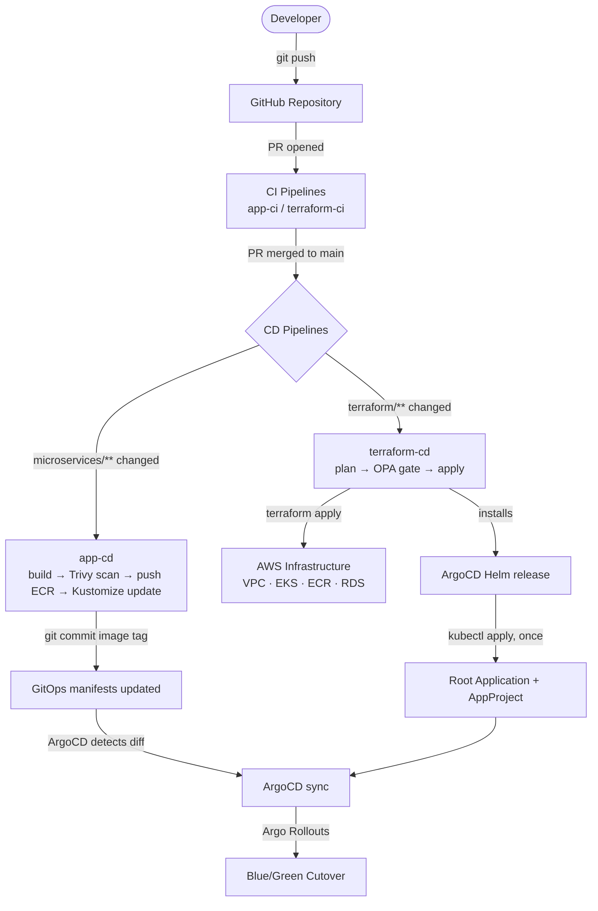
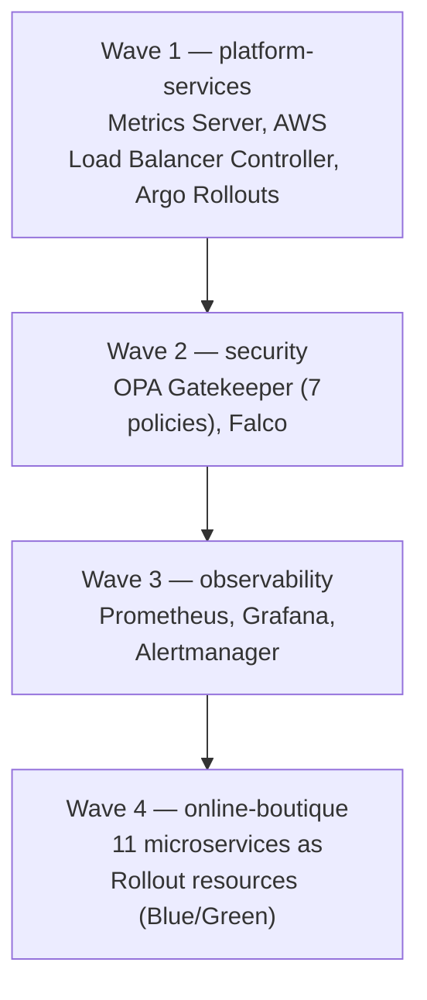
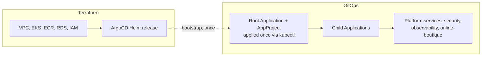
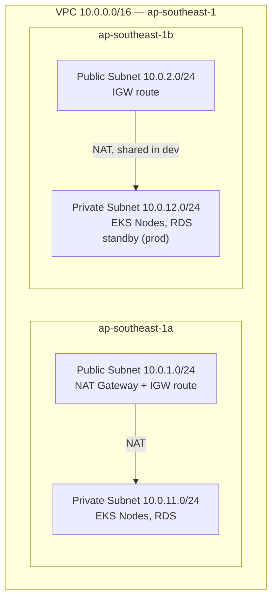
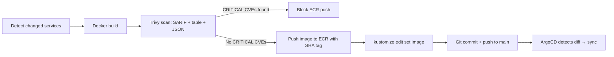
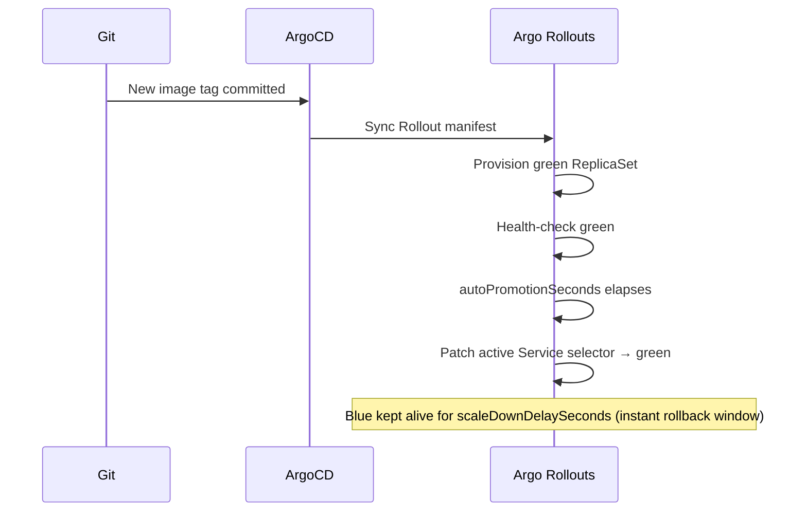
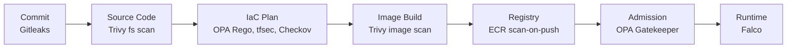
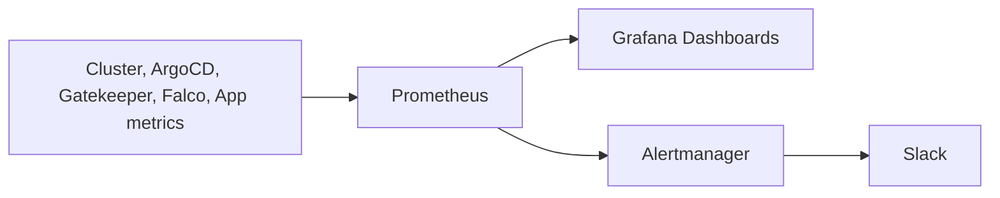
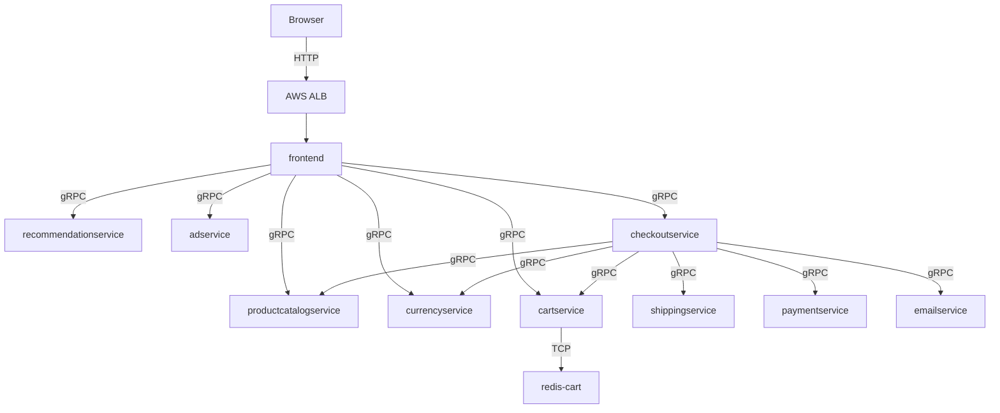

# Cloud-Native Secure GitOps Platform on AWS EKS

A cloud-native DevSecOps platform on AWS EKS, demonstrating secure, automated, scalable delivery through GitOps.

It uses Online Boutique, a microservices e-commerce demo, as its workload — but the goal is the platform itself: infrastructure automation, continuous delivery, policy enforcement, runtime security, and observability, unified in one operational workflow.

Infrastructure as Code, GitOps, automated security controls, and centralized monitoring together let infrastructure, applications, and policy all be managed through Git — for reliable deployments, stronger security governance, and less manual toil.

---

## Table of Contents

1. [Introduction](#1-introduction)
2. [Architecture Overview](#2-architecture-overview)
3. [Solution Architecture](#3-solution-architecture)
4. [Repository Structure](#4-repository-structure)
5. [Infrastructure Design](#5-infrastructure-design)
6. [GitOps & CI/CD Workflow](#6-gitops--cicd-workflow)
7. [Required Secrets & Environments](#7-required-secrets--environments)
8. [Security Architecture](#8-security-architecture)
9. [Monitoring & Observability](#9-monitoring--observability)
10. [Application Architecture](#10-application-architecture)
11. [Deployment Guide](#11-deployment-guide)
12. [Testing & Validation](#12-testing--validation)
13. [Future Enhancements](#13-future-enhancements)
14. [References](#14-references)

---

## 1. Introduction

### Project Overview

A self-contained DevSecOps platform: Terraform provisions AWS infrastructure, bootstraps an EKS cluster, and hands off delivery entirely to GitOps via ArgoCD. Security is enforced at every stage — plan time, image build, admission, and runtime — not bolted on afterward.

### Problem Statement

Microservices teams commonly face three compounding problems: **security drift** (config diverges from policy, vulnerabilities go unnoticed), **manual toil** (infra changes and deploys depend on error-prone human coordination), and **observability gaps** (incidents reach users before they reach engineers).

### Objectives

- Provision AWS infrastructure (networking, compute, registry, database) entirely as code
- Deliver Kubernetes workloads through GitOps, not manual `kubectl apply`
- Enforce security policy at the IaC, image, admission, and runtime layers
- Provide unified metrics, dashboards, and alerting for platform and application

### Scope

| Layer | Technology | Responsibility |
|---|---|---|
| Infrastructure | Terraform on AWS | VPC, EKS, ECR, RDS, ALB, IAM |
| Platform delivery | ArgoCD + Kustomize | GitOps sync, App of Apps |
| Security (static) | OPA Rego | Terraform plan policy gate |
| Security (admission) | OPA Gatekeeper | Kubernetes admission control |
| Security (runtime) | Falco | Syscall-level threat detection |
| Observability | kube-prometheus-stack | Metrics, dashboards, alerting |
| CI/CD | GitHub Actions | Five workflows across infra and application tracks |
| Application | Online Boutique | 11-service gRPC microservices demo |

### Key Capabilities

- Modular Terraform with a remote state backend: S3 versioning, DynamoDB locking, KMS encryption
- ArgoCD App of Apps with sync-wave ordering across platform, security, observability, application layers
- Blue/Green deployments via Argo Rollouts for zero-impact cutover and instant rollback
- OPA Rego gates on Terraform plans, OPA Gatekeeper at admission, Falco at runtime — on every node
- Five GitHub Actions workflows, OIDC-based AWS auth — no long-lived access keys
- Clear split between Terraform and GitOps: Terraform provisions infrastructure and installs ArgoCD; ArgoCD owns everything running on top, including its own Root Application

---

## 2. Architecture Overview

> **[Architecture Diagram Placeholder]**

Terraform provisions a VPC, EKS cluster, ECR repositories, and RDS on AWS, then installs ArgoCD. From there, ArgoCD's Root Application — a static manifest applied once via `kubectl` — takes over, pulling platform services, security tooling, the observability stack, and Online Boutique from Git in strict sync-wave order. GitHub Actions handles both infrastructure changes (plan → OPA gate → apply) and application changes (build → scan → push to ECR → update GitOps manifests), with security scanning embedded at every stage.

---

## 3. Solution Architecture

The platform has five cooperating layers.

- **Infrastructure Layer** — Terraform provisions all AWS resources: a VPC with public/private subnets across two AZs, an EKS cluster with a managed node group, one ECR repository per microservice, an RDS PostgreSQL instance, and the IAM roles the cluster and its controllers need. A dedicated `argocd-bootstrap` module installs ArgoCD via Helm; Terraform's involvement ends there — it does not manage the Root Application.

- **GitOps Layer** — ArgoCD continuously reconciles cluster state against Git. A Root Application and its AppProject are a static manifest at `platform/gitops/argocd/root-app.yaml`, applied once with `kubectl apply` when bootstrapping a new cluster. From then on ArgoCD reconciles it like any other Application — including itself. It watches `platform/gitops/argocd/applications/` and manages four child Applications, each in its own sync wave.

- **Security Layer** — controls at four points: OPA Rego evaluates Terraform plans before apply, Trivy scans images before they reach the registry, OPA Gatekeeper validates every Pod at admission, and Falco inspects syscalls at runtime on every node.

- **Observability Layer** — Prometheus scrapes the cluster, ArgoCD, Gatekeeper, Falco, and application services. Grafana visualizes it via three dashboards; Alertmanager routes alerts to Slack.

- **Application Layer** — Online Boutique runs as 11 gRPC microservices plus a Redis cache and a load generator, deployed as Argo Rollouts resources for Blue/Green delivery.

### End-to-End Platform Flow



### Sync Wave Ordering

Components deploy in strict wave order so admission webhooks and dependencies are ready before the components that need them start.



### Terraform / GitOps Ownership Boundary

A Terraform-managed Kubernetes resource tracks the entire object, including fields ArgoCD rewrites continuously (sync status, health, last operation). Keeping the Root Application and AppProject outside Terraform avoids mistaking those reconciliations for drift, and keeps the boundary between the two tools clean:



---

## 4. Repository Structure

```text
aws-eks-devsecops-platform/
├── .github/workflows/              # CI/CD: terraform-ci, terraform-cd, app-ci, app-cd, check-scan
├── microservices-application/      # Online Boutique source code (11 services + protos)
├── platform/
│   ├── infrastructure/terraform/   # IaC: oidc-bootstrap, bootstrap, environments, modules, OPA policies
│   ├── gitops/                     # ArgoCD root-app.yaml + App of Apps + Kustomize manifests
└── docs/                           # Architecture notes and diagram sources
```

---

## 5. Infrastructure Design

### AWS Networking



The VPC module applies the Kubernetes subnet tags the AWS Load Balancer Controller needs for automatic subnet discovery:

| Tag | Value | Subnet | Purpose |
|---|---|---|---|
| `kubernetes.io/role/elb` | `1` | Public | Internet-facing ALB subnet discovery |
| `kubernetes.io/role/internal-elb` | `1` | Private | Internal ALB subnet discovery |
| `kubernetes.io/cluster/<name>` | `shared` | Both | EKS subnet ownership |

**Security Groups:**

| Security Group | Inbound | Outbound |
|---|---|---|
| EKS Control Plane | Node group (HTTPS 443) | Node group (all) |
| EKS Nodes | Control plane, node-to-node | All (ECR pull, AWS API) |
| ALB | Internet (HTTP 80, HTTPS 443) | EKS nodes |
| RDS | EKS nodes (PostgreSQL 5432) | None |

### Amazon EKS

The cluster (`eks-devsecops-dev-cluster`, Kubernetes 1.33) runs one managed node group of `t3.medium` instances (`AL2023_x86_64_STANDARD`, on-demand, 20 GiB gp3) with `desired=2, min=1, max=3` and rolling updates (`max_unavailable=1`). Public and private API endpoints are both enabled, and control plane logs (`api`, `audit`, `authenticator`, `controllerManager`, `scheduler`) go to CloudWatch.

Terraform manages four EKS addons:

| Addon | Purpose |
|---|---|
| `vpc-cni` | Pod networking and IP allocation from the VPC CIDR |
| `coredns` | Cluster DNS for service discovery |
| `kube-proxy` | Network rules on each node |
| `aws-ebs-csi-driver` | Dynamic PersistentVolume provisioning (gp3) — required by Prometheus |

### Amazon ECR

Eleven repositories, one per Online Boutique service, each with a lifecycle policy. `scan_on_push` is enabled so AWS rescans every pushed image independently of CI's own Trivy scan.

### Amazon RDS

PostgreSQL with a custom parameter group logging connections, disconnections, DDL, and slow queries (threshold 1000ms), matched to the engine version. Single-AZ in dev, Multi-AZ in production. Backups retained 7 days with PITR; Performance Insights enabled.

### IAM & IRSA

| Role | Trust Principal | Attached Policies |
|---|---|---|
| EKS Cluster Role | `eks.amazonaws.com` | `AmazonEKSClusterPolicy`, `AmazonEKSVPCResourceController` |
| EKS Node Group Role | `ec2.amazonaws.com` | `AmazonEKSWorkerNodePolicy`, `AmazonEKS_CNI_Policy`, `AmazonEC2ContainerRegistryReadOnly`, `AmazonSSMManagedInstanceCore` |
| EBS CSI Driver (IRSA) | OIDC → `kube-system:ebs-csi-controller-sa` | `AmazonEBSCSIDriverPolicy` |
| AWS LBC (IRSA) | OIDC → `kube-system:aws-load-balancer-controller` | Custom policy for ALB/NLB management |

IRSA grants AWS permissions at the pod level, not the node level — a compromised pod can't inherit the full node role. That's why AWS LBC and the EBS CSI Driver use IRSA instead of broader node IAM policies.

> **Operational note — AWS LBC via Kustomize `helmCharts`:** Kustomize's Helm inflator renders chart templates but does **not** install CRDs bundled under the chart's `crds/` folder, unlike `helm install`. The AWS Load Balancer Controller chart ships a `TargetGroupBinding`/`IngressClassParams` CRD bundle that must be listed explicitly under `resources:` in `kustomization.yaml` — otherwise the controller pod crash-loops with `no matches for kind "TargetGroupBinding" in version "elbv2.k8s.aws/v1beta1"`. Likewise, `clusterName`/`region`/`vpcId` come from `valuesFile: values.rendered.yaml` (regenerated from live Terraform outputs by `scripts/Render-LbcValues.ps1`), not a hardcoded `valuesInline` block, so a stale VPC ID can't silently point the controller at a non-existent VPC.

### Terraform State Management

A one-time `bootstrap` module (local state) creates the remote backend: an S3 bucket with versioning, KMS encryption, blocked public access, and 90-day non-current version expiry; and a DynamoDB lock table with `PAY_PER_REQUEST` billing and point-in-time recovery. Every environment after that uses this backend.

A separate one-time `oidc-bootstrap` module, also local state, creates the GitHub OIDC Identity Provider and the IAM role GitHub Actions assumes for `terraform-cd`/`app-cd`. Both run before any remote backend or CI/CD role exists, so local state is the only option — see [Section 11](#11-deployment-guide) for the order of operations.

### High Availability Considerations

| Component | Dev | Prod |
|---|---|---|
| EKS Control Plane | Managed (always HA) | Managed (always HA) |
| EKS Nodes | 2 nodes across 2 AZs | 3+ nodes across 2+ AZs |
| NAT Gateway | 1 shared | 1 per AZ |
| RDS PostgreSQL | Single-AZ | Multi-AZ |
| ArgoCD | 1 replica | 2 replicas |
| ALB | Multi-AZ (managed) | Multi-AZ (managed) |

---

## 6. GitOps & CI/CD Workflow

### Application CI Pipeline (`app-ci.yaml`)

Triggered on PRs to `develop` / `feature/**`. Gitleaks scans the full git history as a hard gate; once it passes, Kustomize build validation runs against the Kubernetes 1.33 schema, along with OPA policy unit tests, Falco rule validation, and a non-blocking Trivy filesystem scan uploaded to the GitHub Security tab.

### Application CD Pipeline (`app-cd.yaml`)

Triggered on pushes to `main` touching microservice paths. A `git diff`-based step detects which services changed, then a matrix job builds, scans, and pushes only those:



### Infrastructure CI Pipeline (`terraform-ci.yaml`)

Triggered on PRs to `develop` / `feature/**` touching Terraform paths. Runs `terraform fmt`/`validate`, `tflint`, `tfsec`, and Checkov (CIS/NIST/SOC 2 mappings) — results posted to the PR and Security tab.

### Infrastructure CD Pipeline (`terraform-cd.yaml`)

Triggered on push to `main` or manual dispatch. Runs `terraform plan`, exports it as JSON, evaluates it against three OPA Rego policy files (deny rules block apply; warn rules are logged only), and only proceeds to `apply` if the gate passes. A separate `destroy` job is manual-dispatch-only, in an isolated environment requiring multiple reviewers.

### ArgoCD Synchronization Flow

The Root Application — a static manifest at `platform/gitops/argocd/root-app.yaml`, applied once after Terraform installs ArgoCD — watches `platform/gitops/argocd/applications/` and manages four child Applications. ArgoCD polls Git roughly every three minutes, detects divergence, and reconciles via Kustomize build + server-side apply. `selfHeal: true` means any out-of-band manual change is automatically reverted, including on the Root Application itself.

### Deployment Strategy

Online Boutique services use **Blue/Green** via Argo Rollouts. A new green ReplicaSet is fully provisioned and health-checked before traffic shifts; blue keeps serving all traffic until cutover. Each service exposes `<name>-active` and `<name>-preview` Services, and after `autoPromotionSeconds`, Argo Rollouts atomically patches the active Service selector.



### Rollback Strategy

While `scaleDownDelaySeconds` hasn't elapsed, blue is still running — rollback is one command, and traffic returns within seconds:

```bash
kubectl argo rollouts undo <service-name> -n online-boutique
```

Once blue is scaled down, rollback means reverting the image tag commit in Git (`git revert`) and letting ArgoCD re-sync, running a fresh Blue/Green cycle with the previous image.

---

## 7. Required Secrets & Environments

### GitHub Repository Secrets

| Secret | Purpose | Workflow Usage |
|---|---|---|
| `AWS_DEV_ROLE_ARN` | ARN of the IAM Role trusted via GitHub OIDC | `terraform-cd`, `app-cd`, `check-scan` |
| `BUCKET_TF_STATE` | S3 bucket name from the bootstrap output | `terraform-cd`, `check-scan` |
| `TF_VAR_DB_PASSWORD` | RDS master password | `terraform-cd` |
| `GITOPS_REPO_URL` | Repository URL used by the optional private-repo credentials secret | `terraform-cd` |
| `GITOPS_BOT_TOKEN` | GitHub PAT with content read/write, used to commit image tag updates | `app-cd` |
| `AWS_ACCOUNT_ID` | 12-digit AWS account ID for ECR URI construction | `app-cd` |
| `SLACK_WEBHOOK_URL` | Incoming Webhook URL for pipeline notifications | All workflows |

### OIDC Authentication

Workflows authenticate to AWS via OpenID Connect, not long-lived access keys. GitHub Actions exchanges a short-lived OIDC token for temporary AWS credentials, scoped by a trust policy restricting which repository (and optionally environment) can assume the role — no static AWS keys stored or rotated in GitHub secrets.

For production, tighten the `sub` condition to `environment:dev-apply` to restrict role assumption to the apply job only.

### GitHub Environments

| Environment | Used By | Protection Rules |
|---|---|---|
| `dev-plan` | `terraform-cd` → plan | None — runs automatically |
| `dev-apply` | `terraform-cd` → apply | Optional required reviewers for controlled applies |
| `dev-destroy` | `terraform-cd` → destroy | **Mandatory: 2+ required reviewers, restricted to `main`** |

> `dev-destroy` must always be protected — an unprotected destroy environment with `workflow_dispatch` access can wipe out all infrastructure in under 15 minutes.

---

## 8. Security Architecture

Defense-in-depth, with controls at every stage of the delivery lifecycle.



### Shift-Left Security

Gitleaks scans the full git history on every PR as a hard gate — one detected secret stops the whole pipeline. Trivy scans source code before any image build, uploading SARIF results to the GitHub Security tab.

### Infrastructure Security

`terraform plan` is converted to JSON and evaluated against three OPA Rego policy files before `apply` is allowed:

| Policy File | Key `deny` Rules |
|---|---|
| `security.rego` | EKS unrestricted public endpoint, missing secrets encryption, ECR scan-on-push disabled, RDS publicly accessible, IAM `Action: * / Resource: *` |
| `networking.rego` | Security Group allowing all inbound, SSH open to internet (port 22), EKS nodes in public subnets |
| `compliance.rego` | Missing required tags (`Project`, `Environment`, `ManagedBy`), EBS volume unencrypted, S3 bucket without server-side encryption |

`tfsec` and Checkov also run in CI, catching static misconfigurations and mapping findings to CIS/NIST/SOC 2 frameworks.

### Kubernetes Security

OPA Gatekeeper enforces seven admission policies on every Pod:

| Constraint | Scope | Effect if Violated |
|---|---|---|
| `allow-ecr-and-trusted-registries-only` | `online-boutique` namespace | Rejected — image from unknown registry |
| `disallow-latest-tag` | All namespaces | Rejected — must use an explicit image tag |
| `disallow-privileged` | All namespaces | Rejected — `privileged: true` forbidden |
| `require-labels` | `online-boutique` namespace | Rejected — required labels missing |
| `require-non-root` | All namespaces | Rejected — must run as a non-root UID |
| `require-read-only-root-filesystem` | All namespaces | Rejected — read-only root filesystem required |
| `require-resource-limits` | All namespaces | Rejected — CPU/memory limits required |

System namespaces (`kube-system`, `gatekeeper-system`, `falco`, `monitoring`, `argocd`) are excluded to avoid bootstrapping deadlocks.

### Runtime Security

Falco runs as a DaemonSet on every node using the `modern_ebpf` driver, doing syscall-level threat detection and alerting on suspicious behavior such as shell execution inside containers or unexpected privilege escalation.

### IAM Security

No long-lived AWS access keys anywhere: GitHub Actions uses OIDC, EC2 nodes use instance profiles, platform controllers use IRSA scoped to specific service accounts. ArgoCD RBAC defaults to `readonly`; admin access requires `platform-admins` group membership.

### Defense-in-Depth Summary

| Stage | Control |
|---|---|
| Commit | Gitleaks secret scanning (hard gate) |
| Source code | Trivy filesystem scan |
| Infrastructure plan | OPA Rego deny/warn, tfsec, Checkov |
| Image build | Trivy image scan (blocks ECR push on CRITICAL CVEs) |
| Registry | ECR `scan_on_push` |
| Admission | OPA Gatekeeper (7 constraints) |
| Runtime | Falco eBPF syscall detection |

---

## 9. Monitoring & Observability

### Prometheus

Deployed via kube-prometheus-stack, scraping node-exporter, kube-state-metrics, ArgoCD, OPA Gatekeeper, Falco, and Online Boutique's `/metrics` endpoints. EKS control plane logs ship to CloudWatch (`api`, `audit`, `authenticator`, `controllerManager`, `scheduler`).

### Grafana

Three dashboards provisioned via ConfigMaps: cluster overview (node status, pod counts, ArgoCD application health), node metrics (per-node CPU/memory/disk/network), and application metrics (request rate, error rate, latency using the RED method).

### Alertmanager

Three alert rules route to Slack: high CPU (node > 80% for 5 min), high memory (node > 85% for 5 min), and pod restart loops (> 5 restarts in 15 min).



---

## 10. Application Architecture

### Online Boutique Overview

Google's open-source microservices demo, deployed here as the platform's workload: 11 services across Go, Python, Node.js, Java, and C#, a Redis cache for cart state, and a Locust-based load generator simulating realistic traffic.

### Core Services

| Service | Language | Role |
|---|---|---|
| `frontend` | Go | Web UI and entry point; aggregates all backend services |
| `checkoutservice` | Go | Order orchestration — coordinates cart, payment, shipping, email |
| `cartservice` | C# | Shopping cart state, backed by Redis |
| `productcatalogservice` | Go | Product catalogue |
| `currencyservice` | Node.js | Currency conversion |
| `paymentservice` | Node.js | Mock payment processing |
| `shippingservice` | Go | Shipping cost estimation |
| `emailservice` | Python | Order confirmation simulation |
| `recommendationservice` | Python | Product recommendations |
| `adservice` | Java | Contextual advertisements |
| `loadgenerator` | Python (Locust) | Simulated user traffic |

### Service Communication Flow



All inter-service communication uses gRPC over the cluster's internal DNS. Only `frontend` is exposed externally, via the ALB Ingress — and it integrates with the platform like any other workload: deployed by ArgoCD, governed by OPA Gatekeeper, observed by Falco, scraped by Prometheus.

---

## 11. Deployment Guide

### Prerequisites

| Tool | Minimum Version |
|---|---|
| Terraform | `>= 1.10.0` |
| AWS CLI | `>= 2.x` |
| kubectl | `>= 1.30` |

Ensure AWS credentials are configured and the GitHub repository secrets from [Section 7](#7-required-secrets--environments) are set before starting.

### Bootstrap GitHub OIDC for CI/CD

Run once, with local AWS credentials that have IAM admin permissions, **before** setting up the `AWS_DEV_ROLE_ARN` GitHub secret or running any workflow. This creates the GitHub OIDC Identity Provider and the IAM role (`github-actions-terraform-dev`) GitHub Actions assumes via `sts:AssumeRoleWithWebIdentity` — no static AWS keys stored in GitHub.

```bash
cd platform/infrastructure/terraform/oidc-bootstrap

cat > terraform.tfvars <<EOF
aws_region  = "ap-southeast-1"
github_org  = "<your-github-org-or-username>"
github_repo = "<your-repo-name>"
EOF

terraform init
terraform plan
terraform apply
```

> **Local state only, by design.** Like `bootstrap/`, this module uses local state — the S3 backend and the role it authenticates don't exist yet, so there's nothing remote to store state in. Keep the generated `terraform.tfstate`/`terraform.tfstate.backup` (e.g. encrypted in a password manager or a separate private bucket) so the OIDC provider and role can be updated or destroyed cleanly, instead of re-imported by hand.

Retrieve the role ARN and use it as the `AWS_DEV_ROLE_ARN` GitHub secret:

```bash
aws iam get-role --role-name github-actions-terraform-dev \
  --query 'Role.Arn' --output text
```

> **Dev vs. prod scope.** The role's trust policy condition (`token.actions.githubusercontent.com:sub`) currently allows `repo:<org>/<repo>:*` — any branch, workflow, or environment. This is intentionally broad for dev, and the role is attached to `AdministratorAccess` for the same reason. Before reusing this module for production, tighten `sub` to a specific environment (e.g. `repo:<org>/<repo>:environment:prod-apply`) and replace `AdministratorAccess` with a least-privilege policy scoped to what Terraform actually manages (VPC, EKS, ECR, RDS, IAM, S3, DynamoDB, KMS).

### Bootstrap Terraform Backend

Run once to create the S3 bucket, DynamoDB lock table, and KMS key:

```bash
cd platform/infrastructure/terraform/bootstrap
terraform init; terraform plan; terraform apply
```

Note the outputs, then configure `environments/dev/backend.tf` with the bucket name and table name.

### Deploy Infrastructure

**Option A — GitHub Actions (recommended):** push any change to `platform/infrastructure/terraform/environments/dev/` on `main`, or trigger `terraform-cd.yaml` manually with `action: apply`. The pipeline runs plan → OPA gate → apply automatically.

**Option B — Manual:**

```bash
cd platform/infrastructure/terraform/environments/dev

terraform init
terraform plan
terraform apply -auto-approve
```

This provisions the VPC, EKS cluster, ECR repositories, RDS instance, and installs ArgoCD. It does **not** create the Root Application — that's a separate step below.

### Configure kubectl

```bash
aws eks update-kubeconfig --region ap-southeast-1 --name eks-devsecops-dev-cluster
kubectl get nodes  # expect 2 nodes in Ready state
```

### Verify EKS Cluster

```bash
kubectl get nodes
kubectl get pods -n argocd  # expect ArgoCD pods Running
```

### Verify ArgoCD

```bash
kubectl port-forward svc/argocd-server -n argocd 8080:443
```

Decode the initial admin password (PowerShell):

```powershell
[System.Text.Encoding]::UTF8.GetString(
    [System.Convert]::FromBase64String(
        (kubectl get secret argocd-initial-admin-secret -n argocd -o jsonpath="{.data.password}")
    )
)

# or, in two steps:
$pwd = kubectl get secret argocd-initial-admin-secret -n argocd -o jsonpath="{.data.password}"
[System.Text.Encoding]::UTF8.GetString([System.Convert]::FromBase64String($pwd))
```

On macOS/Linux, use instead:

```bash
kubectl get secret argocd-initial-admin-secret -n argocd \
  -o jsonpath="{.data.password}" | base64 -d
```

Open `https://localhost:8080`.

### Bootstrap the Root Application

Required once per cluster, immediately after ArgoCD is installed. Creates the AppProject and Root Application from a static manifest; ArgoCD then reconciles both directly from Git:

```bash
kubectl apply -f platform/gitops/argocd/root-app.yaml
```

```bash
kubectl get applications -n argocd
```

The Root Application should reach `Synced / Healthy`, and the four child Applications (`platform-services`, `security`, `observability`, `online-boutique`) should follow within 5–10 minutes.

### Deploy Application

ArgoCD deploys Online Boutique automatically at wave 4 — no manual step required.

```bash
kubectl get pods -n online-boutique
kubectl argo rollouts list rollouts -n online-boutique
```

### Access Application

```bash
kubectl get ingress -n online-boutique frontend \
  -o jsonpath='{.status.loadBalancer.ingress[0].hostname}'
```

Open the returned ALB DNS name in a browser to load the storefront.

### Access Monitoring Stack

```bash
kubectl port-forward svc/kube-prometheus-stack-grafana -n monitoring 3000:80
# Default credentials: admin / prom-operator
```

Open `http://localhost:3000` and browse the provisioned dashboards.

### Verify Security Components

```bash
kubectl get pods -n gatekeeper-system
kubectl get constrainttemplates
kubectl get pods -n falco
kubectl logs -n falco -l app.kubernetes.io/name=falco --tail=20
```

---

## 12. Testing & Validation

### Infrastructure

```bash
terraform fmt -check -recursive platform/infrastructure/terraform/
cd platform/infrastructure/terraform/environments/dev && terraform validate
tfsec platform/infrastructure/terraform/
checkov -d platform/infrastructure/terraform/ --framework terraform
```

### Security Controls

```bash
# Secret scanning
gitleaks detect --source . --verbose

# Image scan
trivy fs . --severity CRITICAL,HIGH

# Gatekeeper admission enforcement (expect rejection)
kubectl run test --image=nginx:latest -n online-boutique
```

### GitOps Workflow

```bash
# Kustomize build validation
kustomize build platform/gitops/kustomize/overlays/dev/ > /dev/null && echo "OK"

# ArgoCD application health
kubectl get applications -n argocd \
  -o jsonpath='{range .items[*]}{.metadata.name}{"\t"}{.status.sync.status}{"\t"}{.status.health.status}{"\n"}{end}'

# Verify selfHeal (make a manual change, observe ArgoCD revert it)
kubectl scale deployment frontend -n online-boutique --replicas=5
sleep 180
kubectl get deployment frontend -n online-boutique -o jsonpath='{.spec.replicas}'
# Expected: 1
```

### Application Availability

```bash
kubectl argo rollouts list rollouts -n online-boutique

ALB=$(kubectl get ingress -n online-boutique frontend \
  -o jsonpath='{.status.loadBalancer.ingress[0].hostname}')
curl -s -o /dev/null -w "%{http_code}" "http://${ALB}"   # expect 200
```

### Monitoring Stack

```bash
kubectl exec -n monitoring deploy/kube-prometheus-stack-prometheus -- \
  wget -qO- "http://localhost:9090/api/v1/targets" | \
  jq '.data.activeTargets[] | select(.labels.namespace=="online-boutique") | {job: .labels.job, health: .health}'
```

---

## 13. Future Enhancements

### Short-Term

| Enhancement | Rationale |
|---|---|
| ArgoCD webhook | Replace 3-minute polling with instant Git push notification |
| Argo Rollouts Canary | Extend to canary strategy with Analysis templates for automated promotion/abort |
| External Secrets Operator | Sync secrets from AWS Secrets Manager into Kubernetes Secrets |
| Cluster Autoscaler | Automatic node scaling based on unschedulable pod count |
| HTTPS/TLS termination | ACM certificate on the ALB listener — currently HTTP only |

### Medium-Term

| Enhancement | Rationale |
|---|---|
| GitHub SSO for ArgoCD | Replace the initial admin password with GitHub OAuth via Dex |
| Falcosidekick | Route Falco alerts to Slack and Prometheus instead of pod logs only |
| Distributed tracing | Add AWS X-Ray or Jaeger for request tracing across gRPC services |
| OPA Gatekeeper mutation | Auto-inject resource limits rather than reject non-compliant Pods |
| Multi-region DR | Deploy a standby cluster with RDS cross-region replication |

### Long-Term

| Enhancement | Rationale |
|---|---|
| Multi-cluster ArgoCD | Manage dev and prod clusters from a single ArgoCD instance |
| ApplicationSet | Replace manual Application YAMLs with generators for environment/service matrices |
| Vault integration | Replace AWS Secrets Manager with HashiCorp Vault for dynamic secrets and PKI |
| Service mesh (Istio) | mTLS between services, traffic management, circuit breaking |
| Cost optimisation | Karpenter for node provisioning, KEDA for event-driven scaling |

---

## 14. References

### Official Documentation

- [Amazon EKS Documentation](https://docs.aws.amazon.com/eks/)
- [Terraform AWS Provider](https://registry.terraform.io/providers/hashicorp/aws/latest/docs)
- [ArgoCD Documentation](https://argo-cd.readthedocs.io/)
- [Kustomize Documentation](https://kustomize.io/)
- [OPA Gatekeeper](https://open-policy-agent.github.io/gatekeeper/)
- [Falco Documentation](https://falco.org/docs/)
- [kube-prometheus-stack](https://github.com/prometheus-community/helm-charts/tree/main/charts/kube-prometheus-stack)
- [AWS Load Balancer Controller](https://kubernetes-sigs.github.io/aws-load-balancer-controller/)
- [Argo Rollouts](https://argoproj.github.io/argo-rollouts/)

### Related Projects

- [Google Online Boutique](https://github.com/GoogleCloudPlatform/microservices-demo) — demo microservices application used as the platform workload

### Best Practices & Architecture References

- [AWS EKS Best Practices](https://aws.github.io/aws-eks-best-practices/) — security, networking, and reliability guidance
- [GitOps with ArgoCD](https://argo-cd.readthedocs.io/en/stable/user-guide/best_practices/) — App of Apps pattern and GitOps principles
