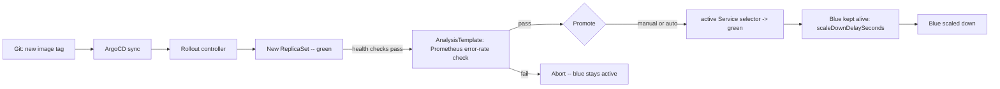

# Blue/Green Deployment Guide — Online Boutique

This document describes the Blue/Green deployment process implemented via **Argo Rollouts** for the three business-critical services in the platform. All other services remain on standard Kubernetes `Deployment` + `RollingUpdate`.

---

## 1. Scope

Blue/Green is applied selectively, not to all 11 microservices. Applying it everywhere adds operational overhead (double the pod capacity during rollout, extra Analysis queries, more moving parts) with no benefit for low-risk, stateless, read-heavy services. Only services where a bad deploy has a large, direct, or hard-to-reverse impact get the extra safety net.

| Service | Blue/Green? | Reason |
|---|---|---|
| `frontend` | Yes | Entry point — every user request passes through it |
| `checkoutservice` | Yes | Orchestrates cart → payment → shipping → email; a failure means a lost order |
| `cartservice` | Yes | Business-critical, holds cart state, changes frequently |
| `productcatalogservice`, `currencyservice`, `shippingservice`, `adservice`, `recommendationservice` | No | Stateless, read-heavy, low risk — rolling update is sufficient |
| `emailservice`, `paymentservice`, `loadgenerator` | No | Mocked / non-critical / internal only |

---

## 2. How Blue/Green Works Here

Each of the three services runs as an Argo Rollouts `Rollout` resource instead of a `Deployment`, backed by two Kubernetes Services:

- **`<service>-active`** — receives 100% of live traffic. The Ingress (for `frontend`) or upstream callers (for `checkoutservice`, `cartservice`) always point here.
- **`<service>-preview`** — points at the new (green) ReplicaSet only, for internal verification before it takes over.



Cutover happens by Argo Rollouts patching the `active` Service's selector — not by changing anything on the ALB or Ingress. This is why the AWS Load Balancer Controller and target groups need no changes during a Blue/Green release.

---

## 3. Safety Gate: AnalysisTemplate

Instead of promoting on a blind timer, each Rollout is gated by a shared `AnalysisTemplate` that queries Prometheus (already deployed via kube-prometheus-stack):

```yaml
apiVersion: argoproj.io/v1alpha1
kind: AnalysisTemplate
metadata:
  name: success-rate-check
spec:
  args:
    - name: service-name
  metrics:
    - name: error-rate
      interval: 1m
      count: 5
      successCondition: result[0] < 0.01
      failureLimit: 2
      provider:
        prometheus:
          address: http://kube-prometheus-stack-prometheus.monitoring:9090
          query: |
            sum(rate(http_requests_total{service="{{args.service-name}}",code=~"5.."}[2m]))
            /
            sum(rate(http_requests_total{service="{{args.service-name}}"}[2m]))
```

If the 5xx error rate reaches 1% or higher across 2 of 5 checks, the Rollout **aborts automatically** — blue keeps serving traffic, no human action required.

- **`frontend`** uses `postPromotionAnalysis` — traffic is verified through the `preview` Service manually (via port-forward) before promotion, then Analysis confirms health after the switch.
- **`checkoutservice`** and **`cartservice`** use `prePromotionAnalysis` — internal gRPC services have no manual preview step, so Analysis must pass before promotion is allowed.

---

## 4. Promotion Mode

| Environment | `autoPromotionEnabled` | Behavior |
|---|---|---|
| Dev | `true` (`autoPromotionSeconds: 30`) | Promotes automatically after 30s if healthy — fast iteration, low stakes |
| Prod | `false` | Requires a human to run `promote` after reviewing dashboards/QA — standard practice for customer-facing services |

---

## 5. Per-Service Configuration

### `frontend`

```yaml
apiVersion: argoproj.io/v1alpha1
kind: Rollout
metadata:
  name: frontend
spec:
  replicas: 2
  strategy:
    blueGreen:
      activeService: frontend-active
      previewService: frontend-preview
      autoPromotionEnabled: false
      scaleDownDelaySeconds: 300
      postPromotionAnalysis:
        templates:
          - templateName: success-rate-check
        args:
          - name: service-name
            value: frontend
  selector:
    matchLabels:
      app: frontend
  template:
    metadata:
      labels:
        app: frontend
    spec: {}  # unchanged from the existing Deployment pod spec
---
apiVersion: v1
kind: Service
metadata:
  name: frontend-active
spec:
  selector: { app: frontend }
  ports: [{ port: 80, targetPort: 8080 }]
---
apiVersion: v1
kind: Service
metadata:
  name: frontend-preview
spec:
  selector: { app: frontend }
  ports: [{ port: 80, targetPort: 8080 }]
```

> The ALB Ingress must point to `frontend-active` (previously `frontend`). No other ALB configuration changes.

### `checkoutservice`

```yaml
apiVersion: argoproj.io/v1alpha1
kind: Rollout
metadata:
  name: checkoutservice
spec:
  replicas: 2
  strategy:
    blueGreen:
      activeService: checkoutservice-active
      previewService: checkoutservice-preview
      autoPromotionEnabled: false
      scaleDownDelaySeconds: 300
      prePromotionAnalysis:
        templates:
          - templateName: success-rate-check
        args:
          - name: service-name
            value: checkoutservice
  selector:
    matchLabels:
      app: checkoutservice
  template:
    metadata:
      labels:
        app: checkoutservice
    spec: {}  # unchanged from the existing Deployment pod spec
---
apiVersion: v1
kind: Service
metadata:
  name: checkoutservice-active
spec:
  selector: { app: checkoutservice }
  ports: [{ port: 5050, targetPort: 5050 }]
---
apiVersion: v1
kind: Service
metadata:
  name: checkoutservice-preview
spec:
  selector: { app: checkoutservice }
  ports: [{ port: 5050, targetPort: 5050 }]
```

### `cartservice`

```yaml
apiVersion: argoproj.io/v1alpha1
kind: Rollout
metadata:
  name: cartservice
spec:
  replicas: 2
  strategy:
    blueGreen:
      activeService: cartservice-active
      previewService: cartservice-preview
      autoPromotionEnabled: false
      scaleDownDelaySeconds: 300
      prePromotionAnalysis:
        templates:
          - templateName: success-rate-check
        args:
          - name: service-name
            value: cartservice
  selector:
    matchLabels:
      app: cartservice
  template:
    metadata:
      labels:
        app: cartservice
    spec: {}  # unchanged from the existing Deployment pod spec, including Redis connection env vars
---
apiVersion: v1
kind: Service
metadata:
  name: cartservice-active
spec:
  selector: { app: cartservice }
  ports: [{ port: 7070, targetPort: 7070 }]
---
apiVersion: v1
kind: Service
metadata:
  name: cartservice-preview
spec:
  selector: { app: cartservice }
  ports: [{ port: 7070, targetPort: 7070 }]
```

---

## 6. Prerequisites in the Cluster

Before any of the above works, confirm:

```bash
# Argo Rollouts controller running
kubectl get pods -n argo-rollouts

# CRDs installed
kubectl get crd | grep argoproj.io

# kubectl plugin (for CLI commands below)
kubectl krew install argo-rollouts
kubectl argo rollouts version
```

ArgoCD must also be able to evaluate `Rollout` health, or an Application will report `Healthy` even mid-rollout. This is configured once in `argocd-cm` (part of the `argocd-config` Application, sync-wave 0):

```yaml
data:
  resource.customizations.health.argoproj.io_Rollout: |
    hs = {}
    if obj.status ~= nil then
      if obj.status.phase == "Degraded" then
        hs.status = "Degraded"
        hs.message = obj.status.message
        return hs
      elseif obj.status.phase == "Healthy" then
        hs.status = "Healthy"
        hs.message = "Rollout is healthy"
        return hs
      end
    end
    hs.status = "Progressing"
    hs.message = "Rollout in progress"
    return hs
```

---

## 7. Operational Commands

```bash
# Watch a rollout in progress
kubectl argo rollouts get rollout frontend -n online-boutique --watch

# Preview the new version before promoting (frontend only — manual check)
kubectl port-forward svc/frontend-preview -n online-boutique 8081:80

# Promote manually (prod)
kubectl argo rollouts promote frontend -n online-boutique

# Abort a bad rollout — blue keeps serving traffic
kubectl argo rollouts abort frontend -n online-boutique

# Roll back instantly while blue is still alive (within scaleDownDelaySeconds)
kubectl argo rollouts undo frontend -n online-boutique
```

Replace `frontend` with `checkoutservice` or `cartservice` as needed.

---

## 8. Rollback Behavior

| Situation | Rollback method | Time to recover |
|---|---|---|
| Within `scaleDownDelaySeconds` (blue still running) | `kubectl argo rollouts undo <service>` | Seconds — instant Service selector switch back to blue |
| After blue has been scaled down | `git revert` the image tag commit, let ArgoCD re-sync | Minutes — runs a fresh Blue/Green cycle with the previous image |

---

## 9. CI/CD Integration

No changes are required to the existing `app-cd.yaml` pipeline (build → Trivy scan → push to ECR → `kustomize edit set image` → commit). It only updates the image tag in the manifest; because the manifest kind is now `Rollout` instead of `Deployment`, ArgoCD's sync automatically drives the Blue/Green cycle described above.

---

## 10. Notifications

Argo Rollouts has its own notification controller, separate from ArgoCD Notifications, reusing the existing `SLACK_WEBHOOK_URL`:

```yaml
apiVersion: v1
kind: ConfigMap
metadata:
  name: argo-rollouts-notification-configmap
  namespace: argo-rollouts
data:
  trigger.on-rollout-completed: |
    - send: [rollout-completed]
  template.rollout-completed: |
    message: "Rollout {{.rollout.name}} completed in {{.rollout.namespace}}"
  service.slack: |
    token: $slack-token
```
