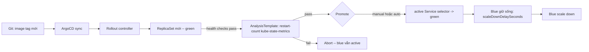

# Blue/Green Deployment Guide — Online Boutique (GitOps với ArgoCD + Argo Rollouts)

Tài liệu này mô tả **quy trình thực tế cần thực hiện** để triển khai Blue/Green cho 3 service trọng yếu (`frontend`, `checkoutservice`, `cartservice`) trong repo `aws-eks-devsecops-platform`, tuân thủ đúng cấu trúc GitOps (App of Apps + Kustomize base/overlays) đang có trong `platform/gitops/`. Toàn bộ 11 service còn lại vẫn giữ nguyên `Deployment` + `RollingUpdate`.

Nguyên tắc xuyên suốt: **mọi thứ đi qua Git**, không ai `kubectl apply` tay ngoài các lệnh vận hành Rollout (promote/abort/undo) — bản thân các lệnh đó cũng chỉ thao tác trên resource đã được ArgoCD tạo ra từ Git.

> **Đã xác minh trên source code thật (Bước 0–2 đã triển khai):** app Online Boutique gốc (`GoogleCloudPlatform/microservices-demo`, image `gcr.io/google-samples/microservices-demo`) **không** tự expose Prometheus HTTP metrics (`src/frontend` không có route `/metrics`, không import `prometheus/client_golang`). Vì vậy tài liệu này **không dùng** `http_requests_total`/error-rate làm điều kiện Analysis như phiên bản thiết kế ban đầu — xem lý do và cách thay thế ở Bước 2.

---

## 1. Phạm vi áp dụng

| Service | Blue/Green? | Lý do |
|---|---|---|
| `frontend` | Có | Entry point — mọi request người dùng đều đi qua |
| `checkoutservice` | Có | Điều phối cart → payment → shipping → email; lỗi = mất đơn hàng |
| `cartservice` | Có | Business-critical, giữ state giỏ hàng, thay đổi thường xuyên |
| `productcatalogservice`, `currencyservice`, `shippingservice`, `adservice`, `recommendationservice` | Không | Stateless, read-heavy, rủi ro thấp — rolling update là đủ |
| `emailservice`, `paymentservice`, `loadgenerator`, `redis-cart`, `shoppingassistantservice` | Không | Mock / nội bộ / không phải business-critical theo nghĩa rollout |

---

## 2. Việc cần làm — theo đúng thứ tự

### Bước 0 — Cài Argo Rollouts controller qua GitOps (một lần, cấp platform) ✅ Đã triển khai

Argo Rollouts **không** được cài bằng tay. Nó phải là một Application con trong App of Apps, giống cách `platform-services`, `observability`, `falco` đang được quản lý trong `argocd/applications/`.

1. Tạo `kustomize/platform-services/argo-rollouts/kustomization.yaml` (thư mục mới, cùng cấp với `aws-load-balancer-controller`, `metrics-server`). Cài đặt qua **Helm chart** (`helmCharts:` trong Kustomize), theo đúng pattern `metrics-server/` đang dùng — không viết tay `deployment.yaml`/`service.yaml`/CRD, Kustomize sẽ tự `helm template` chart ra toàn bộ manifest lúc build:
   ```yaml
   apiVersion: kustomize.config.k8s.io/v1beta1
   kind: Kustomization
   namespace: argo-rollouts
   helmCharts:
     - name: argo-rollouts
       repo: https://argoproj.github.io/argo-helm
       version: 2.41.0
       releaseName: argo-rollouts
       namespace: argo-rollouts
       valuesInline:
         installCRDs: true
         controller:
           replicas: 1
           resources:
             requests: { cpu: 50m, memory: 64Mi }
             limits: { cpu: 200m, memory: 256Mi }
           podSecurityContext:
             runAsNonRoot: true
             runAsUser: 1000
           containerSecurityContext:
             allowPrivilegeEscalation: false
             readOnlyRootFilesystem: true
             capabilities: { drop: [ALL] }
         dashboard:
           enabled: false
   ```
   `installCRDs: true` cài luôn CRD `Rollout`, `AnalysisTemplate`, `AnalysisRun`, `Experiment` cùng lúc với controller. `podSecurityContext`/`containerSecurityContext` non-root, read-only rootfs để không bị Gatekeeper (`require-non-root`, `require-read-only-root-filesystem`) chặn.
2. Thêm entry `argo-rollouts/` vào `kustomize/platform-services/kustomization.yaml` (`resources:`).
3. Application `platform-services.yaml` trong `argocd/applications/` đã trỏ tới thư mục `platform-services` này — không cần tạo Application mới, chỉ cần commit thư mục Argo Rollouts vào đúng chỗ và để ArgoCD tự sync theo sync-wave hiện có.
4. Xác nhận qua `kubectl get pods -n argo-rollouts` và `kubectl get crd | grep argoproj.io` sau khi ArgoCD sync xong.

### Bước 1 — Đăng ký sức khỏe của `Rollout` với ArgoCD ✅ Đã triển khai

Vì `Rollout` là CRD của Argo Rollouts, ArgoCD mặc định không biết cách đánh giá "Healthy/Progressing/Degraded" cho nó — Application sẽ báo `Healthy` ngay cả khi rollout đang giữa chừng nếu không cấu hình.

- Thêm key `resource.customizations.health.argoproj.io_Rollout` (Lua script) vào `data:` **đã có sẵn** trong `argocd/config/argocd-cm-patch.yaml` — đây là ConfigMap `argocd-cm`, được đồng bộ bởi Application `argocd-config` (sync-wave `"0"`, chạy sớm nhất). Chỉ thêm key mới cạnh key `ConstraintTemplate` hiện có, **không tạo file mới, không sửa `argocd/config/kustomization.yaml`** (đã include sẵn file này).

```yaml
data:
  resource.customizations.health.templates.gatekeeper.sh_ConstraintTemplate: |
    # ... (giữ nguyên, đã có từ trước)

  resource.customizations.health.argoproj.io_Rollout: |
    hs = {}
    if obj.status ~= nil then
      if obj.status.phase == "Degraded" then
        hs.status = "Degraded"
        hs.message = obj.status.message
        return hs
      elseif obj.status.phase == "Healthy" then
        hs.status = "Healthy"
        hs.message = "Rollout is healthy"
        return hs
      end
    end
    hs.status = "Progressing"
    hs.message = "Rollout in progress"
    return hs
```

### Bước 2 — Thêm `AnalysisTemplate` dùng chung ✅ Đã triển khai (đổi metric so với thiết kế ban đầu)

**Vì sao không dùng `http_requests_total`:** thiết kế ban đầu định query error-rate HTTP qua Prometheus. Đã xác minh trực tiếp trên `src/frontend` (Go) của Online Boutique gốc — không có route `/metrics`, không import `prometheus/client_golang`. `ServiceMonitor` trong `kustomize/observability/kube-prometheus-stack/servicemonitors/online-boutique.yaml` chỉ định nghĩa *nơi* Prometheus sẽ scrape (`/metrics` trên port `http`/`grpc`), không đảm bảo app *có* endpoint đó. Nếu giữ nguyên query cũ, kết quả luôn là "no data" → Argo Rollouts coi AnalysisRun là `Inconclusive` → **Rollout treo vĩnh viễn**, không bao giờ tự abort cũng không bao giờ tự promote được.

**Thay thế bằng metric có thật, luôn tồn tại** từ `kube-state-metrics` (thành phần của `kube-prometheus-stack`, không phụ thuộc app phải tự instrument gì): đếm số lần container của pod thuộc **bản mới (green)** bị restart trong lúc phân tích. Nếu pod bản mới liên tục crash/OOMKilled/lỗi startup, Analysis fail và Rollout tự abort, blue tiếp tục nhận traffic.

Tạo file mới `kustomize/applications/online-boutique/analysis-template.yaml`:

```yaml
apiVersion: argoproj.io/v1alpha1
kind: AnalysisTemplate
metadata:
  name: success-rate-check
spec:
  args:
    - name: service-name
    - name: pod-template-hash
  metrics:
    - name: restart-count
      interval: 1m
      count: 5
      successCondition: result[0] == 0
      failureLimit: 2
      provider:
        prometheus:
          address: http://kube-prometheus-stack-prometheus.monitoring:9090
          query: |
            sum(
              kube_pod_container_status_restarts_total{
                namespace="online-boutique",
                pod=~"{{args.service-name}}-{{args.pod-template-hash}}-.*"
              }
            )
```

Tham số `pod-template-hash` là bắt buộc — đây là giá trị Argo Rollouts tự gắn vào label `rollouts-pod-template-hash` của ReplicaSet mới mỗi lần tạo bản green, dùng để lọc đúng pod của bản mới thay vì tính chung với pod bản cũ (blue). Cách Rollout truyền giá trị này vào Analysis được cấu hình ở Bước 3 (mục 4, `args` của `prePromotionAnalysis`/`postPromotionAnalysis`).

Đăng ký file này vào `kustomize/applications/online-boutique/kustomization.yaml` (`resources:` gốc, không thuộc thư mục con nào — cùng cấp `adservice`, `cartservice`, ...).

> **Giới hạn cần biết:** cách này chỉ phát hiện lỗi kiểu crash/OOMKilled/startup failure, không phát hiện được lỗi kiểu "app chạy nhưng trả sai kết quả" hay "chậm nhưng không crash". Đây là đánh đổi hợp lý khi app chưa có custom metrics và không muốn sửa source code gốc. Nếu sau này tự thêm Prometheus client vào app, có thể nâng cấp Analysis dùng lại error-rate.

### Bước 3 — Chuyển 3 service từ `Deployment` sang `Rollout` (đúng cấu trúc thư mục hiện có)

Với mỗi service trong `kustomize/applications/online-boutique/<service>/`:

1. **Không xoá `deployment.yaml`** theo nghĩa mất pod spec — đổi `kind: Deployment` → `kind: Rollout`, `apiVersion: apps/v1` → `apiVersion: argoproj.io/v1alpha1`, giữ nguyên `spec.selector`, `spec.template` (containers, probes, securityContext...) như file gốc đã có. Nên đổi tên file thành `rollout.yaml` để phản ánh đúng kind, và cập nhật `kustomization.yaml` của service tương ứng.
2. Thêm `spec.strategy.blueGreen` vào Rollout (chi tiết per-service ở mục 5), tham chiếu `templateName: success-rate-check` từ Bước 2 và truyền `pod-template-hash` qua `valueFrom.podTemplateHashValue: Latest` (Argo Rollouts tự điền).
3. **Đổi `service.yaml` hiện tại** — mỗi service hiện chỉ có **một** Service (`frontend`, `cartservice`, `checkoutservice`). Cần thay bằng **hai** Service: `<service>-active` và `<service>-preview`, cùng selector `app: <service>` (Rollout controller sẽ tự patch label `rollouts-pod-template-hash` để phân biệt blue/green — không cần chỉnh selector thủ công).
4. `frontend/ingress.yaml`: đổi `backend.service.name` từ `frontend` → `frontend-active`. Đây là **thay đổi duy nhất** liên quan tới ALB Ingress; AWS Load Balancer Controller không cần cấu hình gì thêm.
5. `checkoutservice`, `cartservice` không có Ingress — các service gọi chúng qua biến môi trường (`CART_SERVICE_ADDR`, `CHECKOUT_SERVICE_ADDR` trong `frontend`/`checkoutservice` deployment) **phải trỏ sang `<service>-active`**, ví dụ `CART_SERVICE_ADDR=cartservice-active:7070`. Cập nhật trong `frontend/deployment.yaml` (đổi thành `Rollout`) và `checkoutservice/deployment.yaml` (đổi thành `Rollout`).

### Bước 4 — Cấu hình promotion theo môi trường qua overlay Kustomize (không sửa base 2 lần)

Base (`kustomize/applications/online-boutique/*`) chứa cấu hình **prod-safe mặc định**: `autoPromotionEnabled: false`.

- **Prod** (`kustomize/overlays/prod/`): không cần patch gì thêm cho phần promotion — kế thừa nguyên base.
- **Dev** (`kustomize/overlays/dev/applications/online-boutique/`): thêm một patch mới `bluegreen-autopromote-patch.yaml` chỉ áp cho 3 Rollout, set `autoPromotionEnabled: true` + `autoPromotionSeconds: 30`, đăng ký patch này trong `kustomization.yaml` của overlay dev (cạnh `replicas-patch.yaml`, `configmap-patch.yaml` đã có), target `kind: Rollout` thay vì `kind: Deployment`.

| Environment | `autoPromotionEnabled` | Hành vi |
|---|---|---|
| Dev | `true` (`autoPromotionSeconds: 30`) | Tự promote sau 30s nếu healthy |
| Prod | `false` | Cần con người chạy lệnh `promote` sau khi kiểm tra |

### Bước 5 — Không cần sửa `app-cd.yaml` (CI/CD pipeline)

Pipeline hiện tại (build → Trivy scan → push ECR → `kustomize edit set image` → commit) chỉ update image tag trong manifest. Vì manifest giờ là `kind: Rollout` thay vì `Deployment`, `kustomize edit set image` vẫn hoạt động y hệt (nó thao tác trên `spec.template.spec.containers[].image`, không quan tâm `kind`). ArgoCD sync sẽ tự động kích hoạt chu trình Blue/Green.

### Bước 6 — Commit, mở PR, để ArgoCD tự sync

Vì `online-boutique.yaml` (Application) đã có `syncPolicy.automated` với `prune: true`, `selfHeal: true`, không cần tạo Application mới hay sync tay — chỉ cần:

```bash
git add platform/gitops/kustomize/applications/online-boutique/ \
        platform/gitops/kustomize/overlays/ \
        platform/gitops/argocd/config/argocd-cm-patch.yaml \
        platform/gitops/kustomize/platform-services/
git commit -m "Migrate frontend, checkoutservice, cartservice to Argo Rollouts Blue/Green"
git push
```

ArgoCD phát hiện thay đổi và tự sync theo sync-wave hiện có (`argocd-config` wave 0 → `platform-services` → ... → `online-boutique` wave 7), đúng thứ tự cần thiết: cấu hình health check của ArgoCD và Argo Rollouts controller phải sẵn sàng **trước** khi Rollout của online-boutique được tạo ra.

### Bước 7 — Xác minh thủ công lần đầu

```bash
kubectl get pods -n argo-rollouts
kubectl get crd | grep argoproj.io
kubectl argo rollouts get rollout frontend -n online-boutique --watch
```

---

## 3. Cơ chế hoạt động

Mỗi Rollout được backend bởi hai Service:

- **`<service>-active`** — nhận 100% traffic sống. Ingress (`frontend`) hoặc caller nội bộ (`checkoutservice`, `cartservice` — qua biến môi trường) luôn trỏ vào đây.
- **`<service>-preview`** — trỏ vào ReplicaSet mới (green) để kiểm tra nội bộ trước khi promote.



Cutover xảy ra bằng cách Argo Rollouts patch selector của Service `active` — **không** đổi gì trên ALB/Ingress.

- **`frontend`** dùng `postPromotionAnalysis` — kiểm tra traffic qua `preview` Service thủ công (port-forward), rồi Analysis xác nhận sức khỏe (không bị restart) sau khi switch.
- **`checkoutservice`**, **`cartservice`** dùng `prePromotionAnalysis` — service gRPC nội bộ không có bước preview thủ công, nên Analysis phải pass trước khi được phép promote.

---

## 4. Cấu hình từng service (đích cần đạt sau khi migrate)

### `frontend`

```yaml
apiVersion: argoproj.io/v1alpha1
kind: Rollout
metadata:
  name: frontend
  labels:
    app: frontend
    app.kubernetes.io/name: frontend
    app.kubernetes.io/part-of: aws-eks-devsecops-platform
spec:
  selector:
    matchLabels:
      app: frontend
  strategy:
    blueGreen:
      activeService: frontend-active
      previewService: frontend-preview
      autoPromotionEnabled: false
      scaleDownDelaySeconds: 300
      postPromotionAnalysis:
        templates:
          - templateName: success-rate-check
        args:
          - name: service-name
            value: frontend
          - name: pod-template-hash
            valueFrom:
              podTemplateHashValue: Latest
  template: {}  # giữ nguyên metadata.labels + spec từ Deployment gốc (containers, probes, securityContext)
---
apiVersion: v1
kind: Service
metadata:
  name: frontend-active
  labels:
    app: frontend
spec:
  type: ClusterIP
  selector: { app: frontend }
  ports: [{ name: http, port: 80, targetPort: 8080 }]
---
apiVersion: v1
kind: Service
metadata:
  name: frontend-preview
  labels:
    app: frontend
spec:
  type: ClusterIP
  selector: { app: frontend }
  ports: [{ name: http, port: 80, targetPort: 8080 }]
```

> `frontend/ingress.yaml`: `backend.service.name` đổi thành `frontend-active`. Không có thay đổi ALB nào khác.

### `checkoutservice`

```yaml
apiVersion: argoproj.io/v1alpha1
kind: Rollout
metadata:
  name: checkoutservice
  labels:
    app: checkoutservice
    app.kubernetes.io/name: checkoutservice
    app.kubernetes.io/part-of: aws-eks-devsecops-platform
spec:
  selector:
    matchLabels:
      app: checkoutservice
  strategy:
    blueGreen:
      activeService: checkoutservice-active
      previewService: checkoutservice-preview
      autoPromotionEnabled: false
      scaleDownDelaySeconds: 300
      prePromotionAnalysis:
        templates:
          - templateName: success-rate-check
        args:
          - name: service-name
            value: checkoutservice
          - name: pod-template-hash
            valueFrom:
              podTemplateHashValue: Latest
  template: {}  # giữ nguyên spec Deployment gốc; CART_SERVICE_ADDR -> cartservice-active:7070
---
apiVersion: v1
kind: Service
metadata:
  name: checkoutservice-active
  labels:
    app: checkoutservice
spec:
  type: ClusterIP
  selector: { app: checkoutservice }
  ports: [{ name: grpc, port: 5050, targetPort: 5050 }]
---
apiVersion: v1
kind: Service
metadata:
  name: checkoutservice-preview
  labels:
    app: checkoutservice
spec:
  type: ClusterIP
  selector: { app: checkoutservice }
  ports: [{ name: grpc, port: 5050, targetPort: 5050 }]
```

### `cartservice`

```yaml
apiVersion: argoproj.io/v1alpha1
kind: Rollout
metadata:
  name: cartservice
  labels:
    app: cartservice
    app.kubernetes.io/name: cartservice
    app.kubernetes.io/part-of: aws-eks-devsecops-platform
spec:
  selector:
    matchLabels:
      app: cartservice
  strategy:
    blueGreen:
      activeService: cartservice-active
      previewService: cartservice-preview
      autoPromotionEnabled: false
      scaleDownDelaySeconds: 300
      prePromotionAnalysis:
        templates:
          - templateName: success-rate-check
        args:
          - name: service-name
            value: cartservice
          - name: pod-template-hash
            valueFrom:
              podTemplateHashValue: Latest
  template: {}  # giữ nguyên spec Deployment gốc, gồm REDIS_ADDR=redis-cart:6379
---
apiVersion: v1
kind: Service
metadata:
  name: cartservice-active
  labels:
    app: cartservice
spec:
  type: ClusterIP
  selector: { app: cartservice }
  ports: [{ name: grpc, port: 7070, targetPort: 7070 }]
---
apiVersion: v1
kind: Service
metadata:
  name: cartservice-preview
  labels:
    app: cartservice
spec:
  type: ClusterIP
  selector: { app: cartservice }
  ports: [{ name: grpc, port: 7070, targetPort: 7070 }]
```

> `redis-cart` không đổi — vẫn là `Deployment` thường, chỉ `cartservice` (client của Redis) chuyển sang Rollout.

---

## 5. Lệnh vận hành

```bash
# Theo dõi rollout
kubectl argo rollouts get rollout frontend -n online-boutique --watch

# Xem trước bản mới trước khi promote (chỉ frontend — bước kiểm tra thủ công)
kubectl port-forward svc/frontend-preview -n online-boutique 8081:80

# Promote thủ công (prod)
kubectl argo rollouts promote frontend -n online-boutique

# Abort rollout lỗi — blue tiếp tục phục vụ traffic
kubectl argo rollouts abort frontend -n online-boutique

# Rollback ngay lập tức trong khi blue còn sống (trong scaleDownDelaySeconds)
kubectl argo rollouts undo frontend -n online-boutique
```

Thay `frontend` bằng `checkoutservice` hoặc `cartservice` khi cần.

---

## 6. Rollback

| Tình huống | Cách rollback | Thời gian |
|---|---|---|
| Trong `scaleDownDelaySeconds` (blue còn chạy) | `kubectl argo rollouts undo <service>` | Vài giây — chỉ đổi lại selector của Service active |
| Sau khi blue đã bị scale down | `git revert` commit đổi image tag, để ArgoCD tự sync lại | Vài phút — chạy lại toàn bộ chu trình Blue/Green với image cũ |

Lưu ý GitOps: `kubectl argo rollouts undo` chỉ là rollback tức thời ở cluster; **trạng thái Git không đổi**. Nếu muốn trạng thái "đích" trong Git khớp với cluster sau khi undo, vẫn cần `git revert` sau đó, nếu không ArgoCD (với `selfHeal: true`) sẽ tự động sync lại về image mới (lỗi) trong lần reconcile tiếp theo.

---

## 7. Thông báo Slack

Argo Rollouts có notification controller riêng, tách khỏi ArgoCD Notifications, dùng chung `SLACK_WEBHOOK_URL` đã cấu hình. Thêm ConfigMap này vào `kustomize/platform-services/argo-rollouts/` (namespace `argo-rollouts`), cùng chỗ với manifest cài đặt controller ở Bước 0 (nếu cần patch thêm ngoài Helm values, thêm file riêng và khai `patches:` trong `kustomization.yaml`):

```yaml
apiVersion: v1
kind: ConfigMap
metadata:
  name: argo-rollouts-notification-configmap
  namespace: argo-rollouts
data:
  trigger.on-rollout-completed: |
    - send: [rollout-completed]
  template.rollout-completed: |
    message: "Rollout {{.rollout.name}} completed in {{.rollout.namespace}}"
  service.slack: |
    token: $slack-token
```

---

## 8. Checklist tổng hợp (PR review)

- [x] `kustomize/platform-services/argo-rollouts/kustomization.yaml` — cài qua Helm chart (`argo-rollouts` v2.41.0), đăng ký vào `platform-services/kustomization.yaml`
- [x] `argocd/config/argocd-cm-patch.yaml` — thêm health check Lua cho `Rollout` vào `data:` đã có sẵn
- [x] `kustomize/applications/online-boutique/analysis-template.yaml` — AnalysisTemplate dùng `kube_pod_container_status_restarts_total` (không dùng `http_requests_total` — app không expose), đăng ký vào kustomization gốc
- [ ] `frontend/`, `checkoutservice/`, `cartservice/`: `deployment.yaml` → `rollout.yaml` (kind `Rollout`, thêm `strategy.blueGreen`, `args.pod-template-hash` trong Analysis)
- [ ] `frontend/`, `checkoutservice/`, `cartservice/`: `service.yaml` → hai Service `-active` / `-preview`
- [ ] `frontend/ingress.yaml`: backend → `frontend-active`
- [ ] `frontend`, `checkoutservice` deployment env: `CART_SERVICE_ADDR`, `CHECKOUT_SERVICE_ADDR` → trỏ `-active`
- [ ] `kustomization.yaml` của từng service cập nhật tên file
- [ ] `overlays/dev/.../kustomization.yaml`: thêm patch `autoPromotionEnabled: true` cho 3 Rollout
- [ ] Không sửa `app-cd.yaml` — không cần thiết
- [ ] Commit, push, theo dõi ArgoCD tự sync theo sync-wave có sẵn
